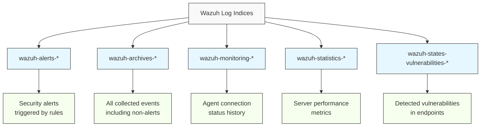
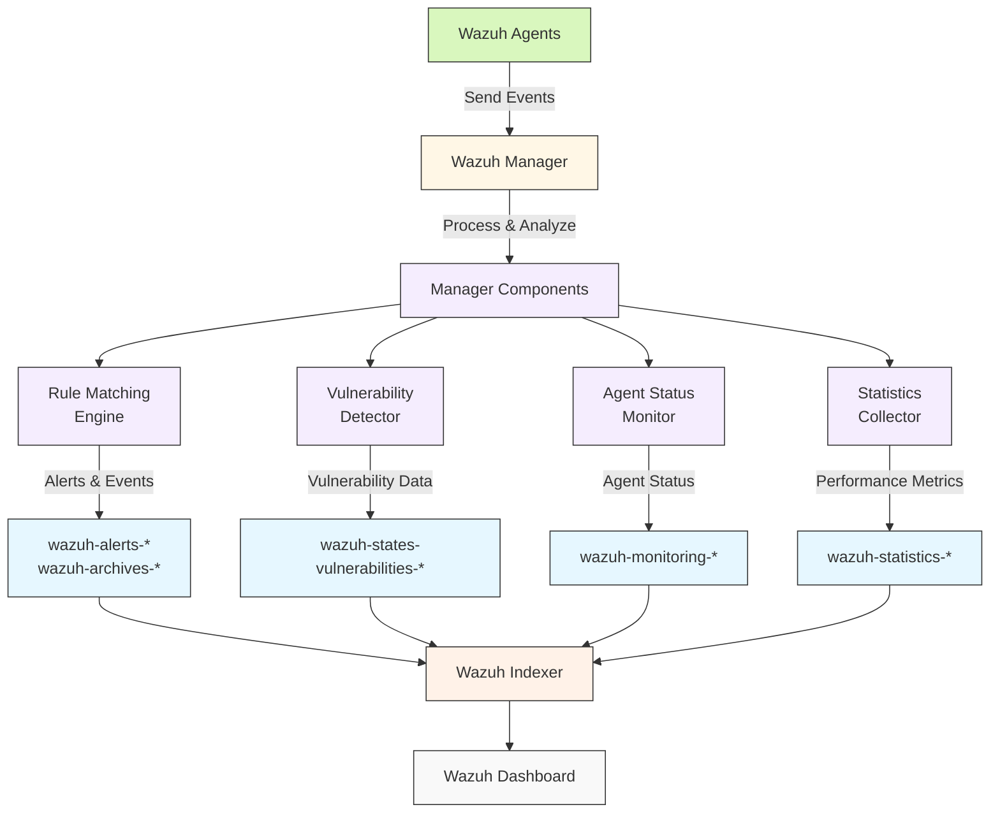

# Wazuh Logs Storage

> [!NOTE]
> This repository contains comprehensive documentation for understanding and managing the various types of Wazuh log indices, their structure, and workflows.

[](https://wazuh.com/)
[](https://documentation.wazuh.com/)

## Overview

[[Wazuh]] is an open-source security monitoring solution that provides unified XDR and SIEM capabilities for enterprise environments. This repository focuses on the technical architecture, data flow, and management of the different Wazuh log indices, providing detailed documentation for security engineers and administrators.

## Repository Structure

```
.
├── README.md
└── logs
    ├── wazuh-alerts-archives
    │   └── README.md       # Documentation on alerts and archives indices
    ├── wazuh-monitoring
    │   └── README.md       # Documentation on agent monitoring indices
    ├── wazuh-states-vulnerabilities
    │   └── README.md       # Documentation on vulnerability state indices
    └── wazuh-statistics
        ├── README.md       # Documentation on server statistics indices
        └── wazuh-logs.md   # Additional information on logs
```

## Wazuh Log Index Patterns

Wazuh uses several specialized index patterns to store different types of data:



## Index Pattern Documentation

This repository contains detailed technical documentation for each Wazuh index pattern:

- **[wazuh-alerts-* and wazuh-archives-*](Wazuh%20Alert%20and%20Archive%20Logs.md)** - Documentation on security alerts and event archives
  - Alert generation workflow
  - Archives data flow
  - Index structure and schema
  - Storage considerations
  - Security implications

- **[wazuh-monitoring-*](Wazuh%20Monitoring%20Indices.md)** - Documentation on agent status monitoring
  - Agent connection states
  - Monitoring data flow
  - Index structure
  - Status tracking lifecycle
  - Dashboard visualizations

- **[wazuh-states-vulnerabilities-*](Wazuh%20Vulnerability%20States%20Indices.md)** - Documentation on vulnerability detection
  - Vulnerability detection workflow
  - CVE correlation process
  - Severity assessment
  - Remediation tracking
  - Reporting capabilities

- **[wazuh-statistics-*](Wazuh%20Statistics%20Index.md)** - Documentation on manager performance metrics
  - Statistics collection
  - Performance metrics
  - Server health monitoring
  - Resource utilization tracking
  - Operational dashboards

## Architecture

The repository documents the overall log flow through the Wazuh platform:



## Features Documented

Each index pattern documentation includes:

- **Detailed Architecture** - Complete technical diagrams of data flow
- **Schema Information** - Field mappings and document structure
- **Configuration Options** - Customization parameters
- **Optimization Strategies** - Performance tuning recommendations
- **Troubleshooting Guides** - Common issues and solutions
- **Security Considerations** - Threat models and protection measures

## Storage Optimization

> [!TIP]
> Each index type has specific optimization recommendations detailed in its respective documentation.

The documentation covers storage optimization strategies:

- **Index Lifecycle Management (ILM)** - Policies for each index type
- **Shard Allocation** - Recommendations based on deployment size
- **Retention Periods** - Guidelines for different compliance requirements
- **Resource Planning** - Storage calculations and capacity planning

## Tags

#security #wazuh #logs #monitoring #elasticsearch #xdr #siem #vulnerabil
