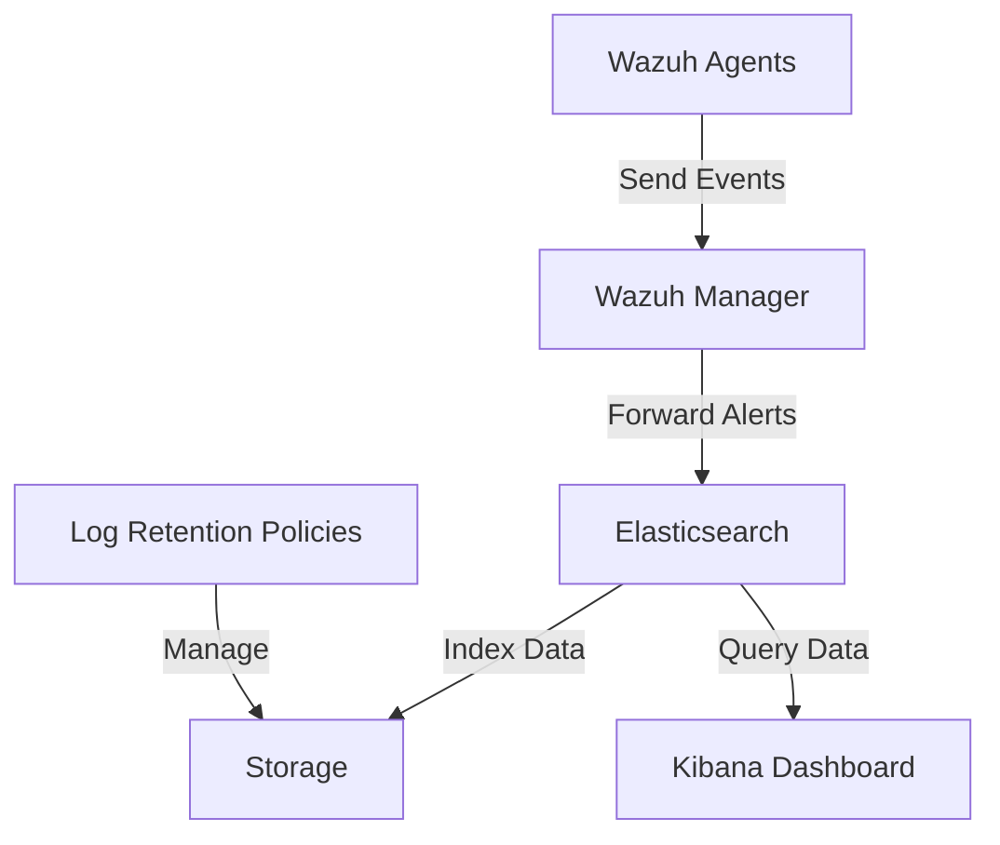
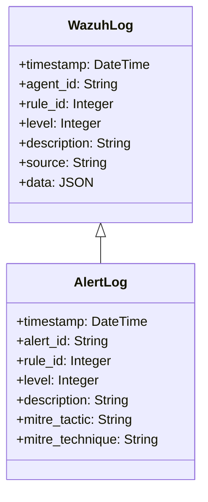

# Wazuh Logs Storage

> [!NOTE]
> This repository contains tools and documentation for managing Wazuh logs storage and analysis.

## Overview

[[Wazuh]] is an open-source security monitoring solution that provides threat detection, integrity monitoring, and compliance capabilities. This project focuses on efficient storage, retrieval, and analysis of Wazuh logs.

## Repository Structure

## Architecture

## Components

- **Wazuh Manager** - Centralized component that receives and analyzes data from agents
- **Elasticsearch** - Stores and indexes Wazuh alerts and events
- **Log Storage** - Configuration for optimized log storage and retention
- **Analysis Tools** - Scripts and tools for log analysis

## Setup Instructions

1. Install dependencies: [[Setup Guide]]
2. Configure storage parameters: [[Storage Configuration]]
3. Set up log rotation: [[Log Rotation]]

## Log Structure

## Storage Optimization

> [!TIP]
> Implement index lifecycle policies in Elasticsearch to manage storage efficiently.

The storage system is designed with the following considerations:
- Hot-warm-cold architecture
- Compression for older logs
- Configurable retention periods based on log criticality

## Tags

#security #wazuh #logs #monitoring #elasticsearch

## Related Resources

- [[Visualization Guide]]
- [[Query Examples]]
- [[Troubleshooting]]

---

For more information, see the [official Wazuh documentation](https://documentation.wazuh.com/).
