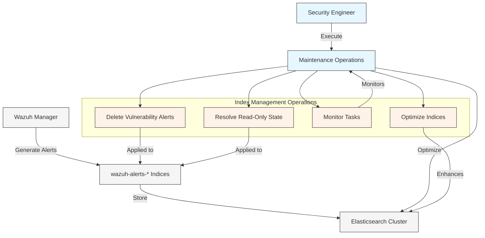

# Managing Wazuh Alert Indices in Elasticsearch

> [!NOTE]
> This document provides comprehensive guidance on managing Wazuh alert indices in Elasticsearch/OpenSearch, with a focus on query optimization and maintenance operations.

**Tags:** #wazuh #elasticsearch #index-management #alerts #vulnerability-detector #performance-tuning #security-operations

## Introduction

Wazuh stores security alerts in daily indices following the pattern `wazuh-alerts-4.x-YYYY.MM.DD`. Over time, these indices can grow significantly, especially when vulnerability detection is enabled. This document outlines key operations for effective management of these indices in a production environment.

## Index Query Operations

### Basic Search Query

The foundational search query to retrieve documents across all indices:

```json
GET _search
{
  "query": {
    "match_all": {}
  }
}
```

> [!CAUTION]
> The above query returns all documents across all indices. In production environments with large datasets, this operation can be resource-intensive and should be used with caution.

**Related concepts:** [[Elasticsearch Query DSL]] [[Wazuh Indexer]] [[Search Operations]]

## Targeted Data Management

### Deleting Vulnerability Detector Alerts

Vulnerability detector alerts can consume significant storage space. The following operations selectively remove these alerts while preserving other security data.

#### Standard Deletion

```json
POST wazuh-alerts-4.x-2025.03.22/_delete_by_query
{
  "query": {
    "match": {
      "rule.groups": "vulnerability-detector"
    }
  }
}
```

> [!INFO]
> This operation removes all documents where `rule.groups` contains "vulnerability-detector" from the specified date index.

**Related concepts:** [[Delete By Query API]] [[Wazuh Vulnerability Detection]] [[Index Management]]

#### Handling Version Conflicts

```json
POST wazuh-alerts-4.x-2025.03.22/_delete_by_query?conflicts=proceed
{
  "query": {
    "match": {
      "rule.groups": "vulnerability-detector"
    }
  }
}
```

The `conflicts=proceed` parameter allows the operation to continue despite document version conflicts, which can occur in highly concurrent environments.

**Related concepts:** [[Elasticsearch Concurrency Control]] [[Version Conflicts]]

## Index Settings Management

### Resolving Read-Only Issues

When Elasticsearch indices enter read-only state (often due to disk space issues), you can restore write capabilities with:

```json
PUT wazuh-alerts-4.x-2025.03.24/_settings
{
  "index.blocks.read_only_allow_delete": null
}
```

> [!WARNING]
> Before removing the read-only flag, always investigate and address the underlying cause, typically disk space utilization exceeding the threshold.

**Related concepts:** [[Disk Space Management]] [[Elasticsearch Watermarks]] [[Index Settings]]

## Cluster and Task Management

### Monitoring Cluster Health

```json
GET /_cluster/health
```

This command provides essential metrics about the overall health of your Elasticsearch/OpenSearch cluster, including status, node count, and shard statistics.

**Related concepts:** [[Elasticsearch Cluster]] [[Health Monitoring]] [[Operational Readiness]]

### Batch Size Management for Large Operations

```json
POST wazuh-alerts-4.x-2025.03.23/_delete_by_query?conflicts=proceed
{
  "query": {
    "match": {
      "rule.groups": "vulnerability-detector"
    }
  },
  "size": 1000
}
```

For large indices, controlling batch size prevents memory pressure and reduces impact on cluster performance.

**Related concepts:** [[Batch Processing]] [[Memory Management]] [[Performance Optimization]]

## Asynchronous Operations

### Background Deletion Tasks

```json
POST wazuh-alerts-4.x-2025.03.24/_delete_by_query?wait_for_completion=false
{
  "query": {
    "match": {
      "rule.groups": "vulnerability-detector"
    }
  }
}
```

The `wait_for_completion=false` parameter executes the deletion as a background task, returning a task ID for later monitoring.

**Related concepts:** [[Asynchronous Processing]] [[Task Management]] [[Background Jobs]]

### Combining Parameters for Production Operations

```json
POST wazuh-alerts-4.x-2025.03.24/_delete_by_query?wait_for_completion=false&conflicts=proceed
{
  "query": {
    "match": {
      "rule.groups": "vulnerability-detector"
    }
  }
}
```

For production environments, combining parameters optimizes operations for reliability and non-disruption.

**Related concepts:** [[Production Best Practices]] [[Operational Resilience]]

## Index Optimization

### Synced Flush Operations

```json
POST wazuh-alerts-4.x-2025.03.23/_flush/synced
```

Synced flush marks index shards with a sync ID, facilitating faster recovery during node restarts.

**Related concepts:** [[Elasticsearch Flush Operations]] [[Shard Management]] [[Recovery Optimization]]

## Task Monitoring

### Listing Active Tasks

```json
GET _tasks
```

Provides information about all currently running tasks in the cluster.

**Related concepts:** [[Task Monitoring]] [[Cluster Operations]]

### Checking Specific Task Status

```json
GET _tasks/Kbw3gEsdR*iHRpv28-GZwg:68449018
```

Monitors the status of a specific asynchronous task by ID.

**Related concepts:** [[Task Status Tracking]] [[Asynchronous Operations]]

## Data Flow Visualization



## Best Practices

1. **Schedule During Off-Hours:** Execute index-altering operations during periods of low activity.

2. **Monitor Cluster Health:** Always check cluster health before and after significant operations.

3. **Use Task Monitoring:** For asynchronous operations, establish a process to track task completion.

4. **Implement Retention Policies:** Consider using Index Lifecycle Management (ILM) for automated index management.

5. **Regular Maintenance:** Schedule routine index optimization tasks to maintain performance.

## Troubleshooting

| Issue | Possible Cause | Resolution |
|-------|---------------|------------|
| Delete operation fails | Version conflicts | Add `conflicts=proceed` parameter |
| Index in read-only state | Disk space threshold exceeded | Increase storage or delete unnecessary data, then clear the read-only flag |
| Slow delete operations | Large number of matching documents | Use asynchronous deletion with `wait_for_completion=false` |
| Task timeouts | Insufficient resources | Adjust batch size and consider off-peak execution |

## Conclusion

Effective management of Wazuh alert indices in Elasticsearch requires understanding of both the Wazuh data structure and Elasticsearch operational commands. Implementing these practices ensures optimal performance and reliability of your security monitoring infrastructure.

**Related resources:**
- [[Wazuh Alert Structure]]
- [[Elasticsearch API Reference]]
- [[Index Lifecycle Management]]
- [[Cluster Administration]]

---

> [!TIP]
> Create a scheduled maintenance plan that incorporates these operations to ensure consistent performance of your Wazuh deployment.

## References

1. [Elasticsearch Delete By Query API](https://www.elastic.co/guide/en/elasticsearch/reference/current/docs-delete-by-query.html)
2. [Wazuh Documentation - Indices](https://documentation.wazuh.com/current/user-manual/elasticsearch/indices.html)
3. [Elasticsearch Task Management API](https://www.elastic.co/guide/en/elasticsearch/reference/current/tasks.html)
4. [Index Management Best Practices](https://www.elastic.co/guide/en/elasticsearch/reference/current/index-management.html)
