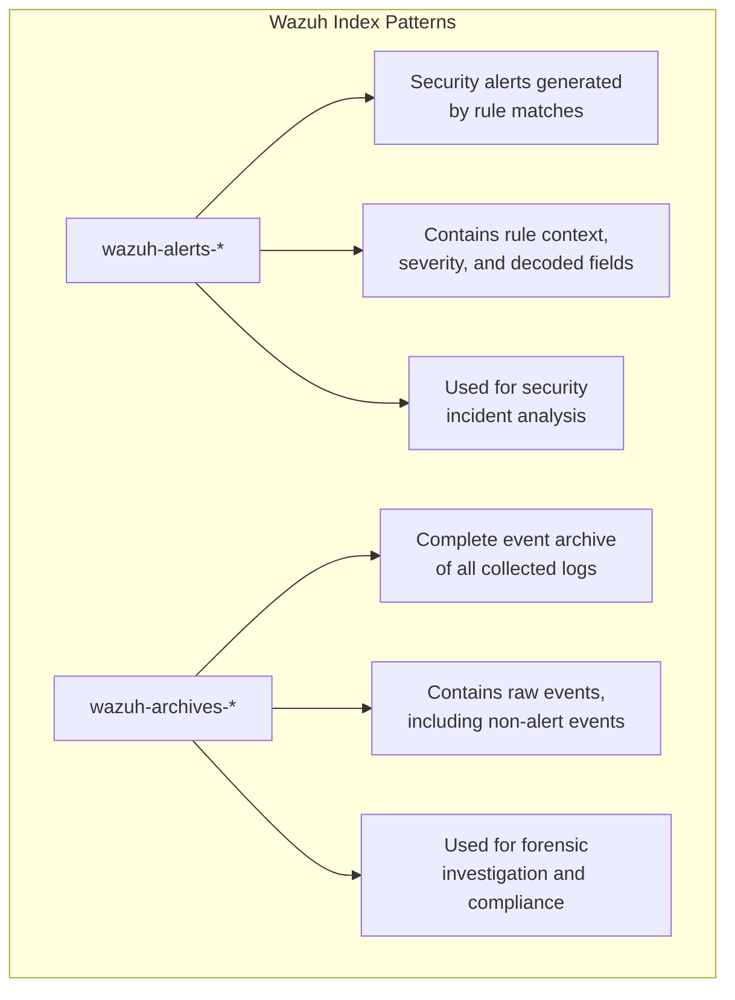
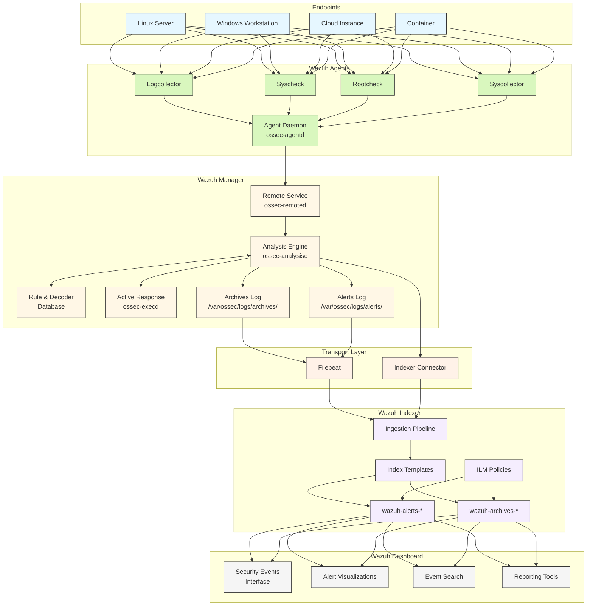
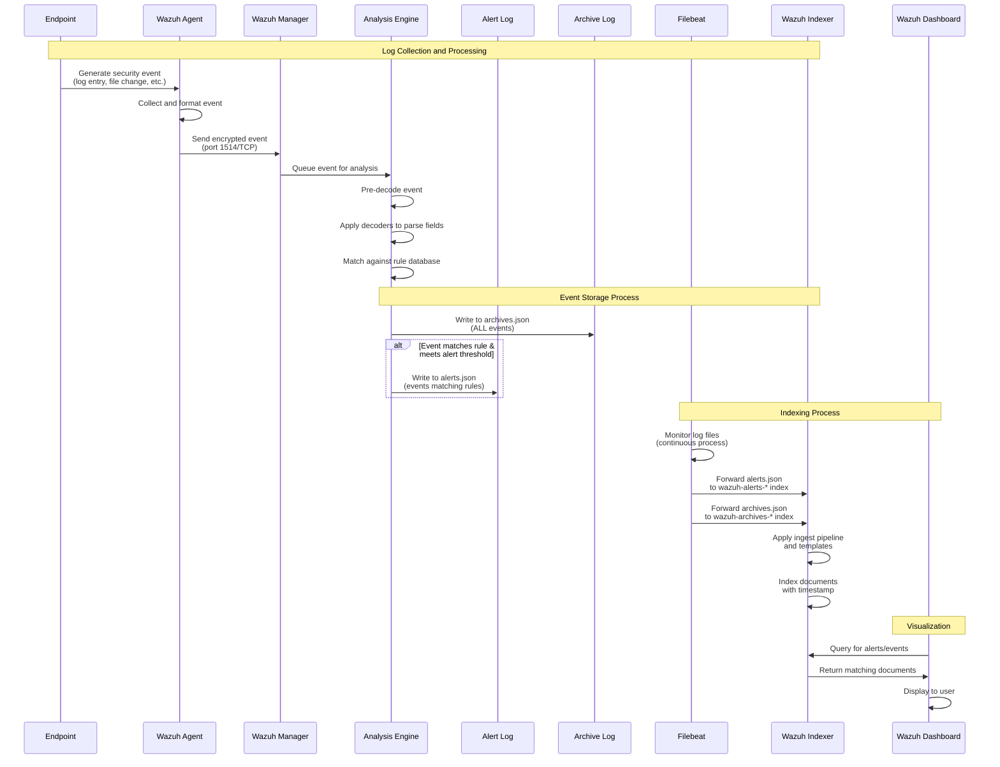
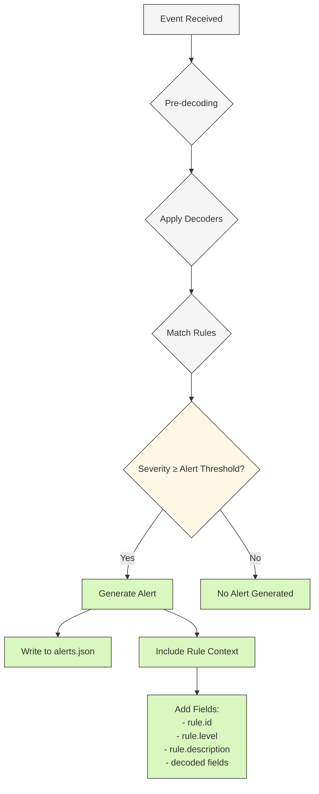
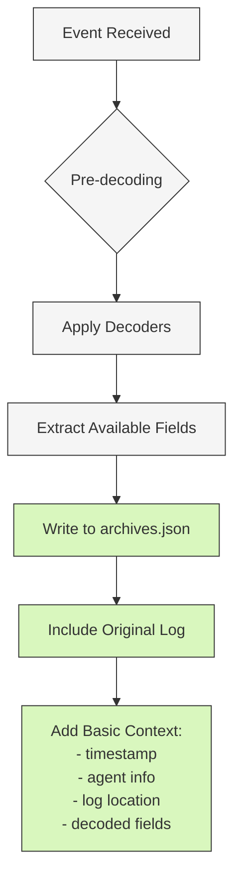
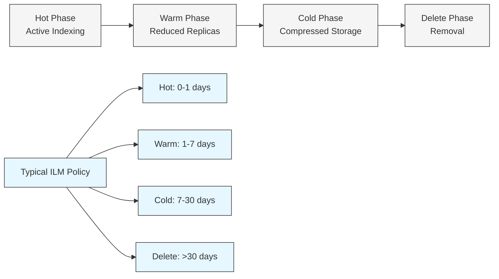
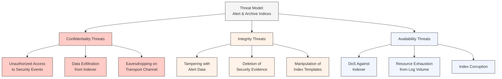
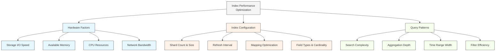
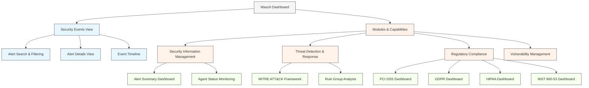

# Wazuh Alert and Archive Logs: Technical Architecture & Workflow

## Executive Summary

This document provides a comprehensive technical overview of how Wazuh processes, stores, and manages security event data through two critical index patterns: `wazuh-alerts-*` and `wazuh-archives-*`. These indices form the foundation of Wazuh's security monitoring capabilities, enabling security teams to detect, analyze, and respond to security incidents effectively.

The document details the complete data flow from log collection on endpoints to final storage and visualization, with particular focus on the architectural components, data transformations, and security considerations related to these essential log indices. Understanding this architecture is crucial for effective deployment, operation, and scaling of Wazuh in enterprise security environments.

## Table of Contents

1. [Introduction](#introduction)
2. [Index Pattern Overview](#index-pattern-overview)
3. [System Architecture](#system-architecture)
4. [Data Collection & Processing Workflow](#data-collection--processing-workflow)
5. [Alert & Archive Generation](#alert--archive-generation)
6. [Data Forwarding & Transport](#data-forwarding--transport)
7. [Index Structure & Schema](#index-structure--schema)
8. [Log Storage & Retention](#log-storage--retention)
9. [Security Considerations](#security-considerations)
10. [Performance Optimization](#performance-optimization)
11. [Querying & Visualization](#querying--visualization)
12. [Troubleshooting Guide](#troubleshooting-guide)
13. [Conclusion](#conclusion)
14. [References](#references)

## Introduction

Wazuh is an open-source security platform that provides unified SIEM (Security Information and Event Management) and XDR (Extended Detection and Response) capabilities. At its core, Wazuh relies on a sophisticated logging architecture that captures, processes, and stores security events from monitored endpoints.

Two fundamental index patterns form the backbone of Wazuh's event storage system:

- **`wazuh-alerts-*`**: Stores security alerts generated when events match specific security rules
- **`wazuh-archives-*`**: Stores all collected events, including those that do not trigger alerts

This document examines the technical architecture behind these index patterns, providing security engineers and administrators with detailed insights into how Wazuh manages security event data throughout its lifecycle.

## Index Pattern Overview

Wazuh employs distinct index patterns to organize different types of data within its ecosystem. The two primary indices for security event data are:



### wazuh-alerts-* Index Pattern

The `wazuh-alerts-*` index pattern stores security alerts generated by the Wazuh manager when events match predefined security rules. These indices contain:

- Security alerts with severity levels (typically 3-15)
- Events that triggered rule matches
- Enriched context including rule details, agent information, and decoded fields
- Critical security incidents requiring attention

By default, Wazuh creates daily indices with names following the pattern `wazuh-alerts-4.x-YYYY.MM.DD` (where 4.x represents the Wazuh version).

### wazuh-archives-* Index Pattern

The `wazuh-archives-*` index pattern stores all events collected by Wazuh agents, regardless of whether they trigger an alert. These indices contain:

- Complete log of all monitored events
- Raw event data before rule matching
- Events that did not match any rule or did not meet the alert threshold
- Comprehensive audit trail for compliance and forensic purposes

Similar to alerts, archive indices follow the naming convention `wazuh-archives-4.x-YYYY.MM.DD` by default.

## System Architecture

The Wazuh architecture consists of several components that work together to collect, process, analyze, and store security events in the alert and archive indices.



### Key Components

1. **Wazuh Agents**: Deployed on endpoints to collect security events from various sources:
   - **Logcollector**: Monitors log files, Windows events, command outputs
   - **Syscheck**: Performs file integrity monitoring (FIM)
   - **Rootcheck**: Detects rootkits and suspicious system behavior
   - **Syscollector**: Gathers system inventory data

2. **Wazuh Manager**: Central server that processes events from agents:
   - **Remote Service (ossec-remoted)**: Receives encrypted events from agents
   - **Analysis Engine (ossec-analysisd)**: Decodes events and applies security rules
   - **Rule & Decoder Database**: Contains detection logic for security events
   - **Archive Log**: Stores all collected events in JSON format
   - **Alert Log**: Stores events that matched security rules

3. **Transport Layer**: Forwards logs from manager to indexer:
   - **Filebeat**: Monitors log files and forwards them to the indexer
   - **Indexer Connector**: Direct API connection for specific data types

4. **Wazuh Indexer**: Storage and search engine (Elasticsearch/OpenSearch):
   - **Ingestion Pipeline**: Processes and transforms incoming data
   - **Index Templates**: Defines mapping and settings for indices
   - **wazuh-alerts-\***: Stores security alerts
   - **wazuh-archives-\***: Stores all collected events
   - **ILM Policies**: Manages index lifecycle and retention

5. **Wazuh Dashboard**: Web interface for visualization and analysis:
   - **Security Events Interface**: Displays alerts and events
   - **Alert Visualizations**: Graphical representations of security data
   - **Event Search**: Allows querying of indexed data
   - **Reporting Tools**: Generates security reports

## Data Collection & Processing Workflow

The following sequence diagram illustrates the complete workflow of how events are collected, processed, and stored in both the alert and archive indices:



### Workflow Stages

1. **Event Generation & Collection**
   - Security event occurs on an endpoint (file change, login attempt, etc.)
   - Wazuh Agent collects the event through its monitoring modules
   - Agent formats the event and forwards it to the manager over encrypted channel

2. **Event Reception & Analysis**
   - Manager's remoted service receives the event and queues it for analysis
   - Analysis engine (analysisd) performs pre-decoding to identify event type
   - Decoders extract relevant fields from the raw log message
   - Rules engine evaluates the event against security rules

3. **Log File Generation**
   - **Archives**: Every received event is written to `/var/ossec/logs/archives/archives.json`
   - **Alerts**: Events matching rules (with severity ≥ alert_level) are written to `/var/ossec/logs/alerts/alerts.json`

4. **Data Forwarding**
   - Filebeat monitors both log files for new entries
   - Alerts are forwarded to the `wazuh-alerts-*` index
   - Archive events are forwarded to the `wazuh-archives-*` index

5. **Indexing & Storage**
   - Indexer receives the data and applies appropriate templates
   - Documents are stored in daily indices with mappings for efficient search
   - Index lifecycle management policies handle retention and optimization

6. **Visualization & Analysis**
   - Dashboard queries the indices to display alerts and events
   - Users can search, filter, and analyze the security data
   - Visualizations provide insights into security posture

## Alert & Archive Generation

Understanding how Wazuh differentiates between alerts and archives is crucial for effective security monitoring.

### Alert Generation Process



Alerts are generated when:

1. An event matches a rule in the Wazuh ruleset
2. The rule's severity level meets or exceeds the configured alert threshold
   - Default threshold is level 3 (configured in `ossec.conf`)
   - Severity ranges from 0 (lowest) to 15 (highest)

The resulting alert contains:
- Original event data
- Rule metadata (ID, description, severity)
- Decoded fields extracted from the log
- Agent information
- Timestamp and location data

### Archive Generation Process



Archives include:

1. **All** events received by the manager, regardless of rule matches
2. Events that don't match any rules
3. Events that match rules but don't meet the alert threshold
4. Basic context without rule information for events that don't trigger alerts

The key difference is that archives provide a complete record of all security events, while alerts focus on events that require attention based on security rules.

## Data Forwarding & Transport

Once events are processed and written to log files on the Wazuh manager, they must be transported to the Wazuh Indexer for storage and search capabilities.

### Filebeat Configuration

Filebeat is the primary mechanism for forwarding logs from the Wazuh Manager to the Wazuh Indexer. It is installed on the manager and configured to monitor both alert and archive log files.

Default Filebeat configuration (`/etc/filebeat/filebeat.yml`):

```yaml
filebeat.inputs:
- type: log
  enabled: true
  paths:
    - /var/ossec/logs/alerts/alerts.json
  json.message_key: message
  json.keys_under_root: true
  json.add_error_key: true
  processors:
    - add_fields:
        target: wazuh
        fields:
          type: alerts

- type: log
  enabled: true
  paths:
    - /var/ossec/logs/archives/archives.json
  json.message_key: message
  json.keys_under_root: true
  json.add_error_key: true
  processors:
    - add_fields:
        target: wazuh
        fields:
          type: archives

output.elasticsearch:
  hosts: ["https://localhost:9200"]
  username: "elastic"
  password: "${ELASTIC_PASSWORD}"
  ssl.certificate_authorities: ["/etc/filebeat/certs/ca.crt"]
  ssl.certificate: "/etc/filebeat/certs/filebeat.crt"
  ssl.key: "/etc/filebeat/certs/filebeat.key"
  indices:
    - index: "wazuh-alerts-4.x-%{+yyyy.MM.dd}"
      when.contains:
        wazuh.type: "alerts"
    - index: "wazuh-archives-4.x-%{+yyyy.MM.dd}"
      when.contains:
        wazuh.type: "archives"
```

This configuration:
- Monitors both alerts.json and archives.json files
- Parses the JSON content
- Adds a field indicating the type (alerts or archives)
- Outputs to the Wazuh Indexer with TLS encryption
- Routes data to the appropriate indices based on type

### Data Transport Security

Wazuh implements several security measures for data in transit:

1. **TLS Encryption**: All communication between Filebeat and the Indexer is encrypted
2. **Certificate Authentication**: Mutual TLS ensures both sides are authenticated
3. **Access Control**: Filebeat uses credentials with specific permissions to write to indices
4. **Network Segmentation**: Recommended to place transport on an isolated network segment

## Index Structure & Schema

Both the `wazuh-alerts-*` and `wazuh-archives-*` indices follow structured schemas defined by index templates in the Wazuh Indexer.

### Index Naming Convention

```
wazuh-alerts-[version]-[date]
wazuh-archives-[version]-[date]
```

Examples:
- `wazuh-alerts-4.x-2025.04.17`
- `wazuh-archives-4.x-2025.04.17`

Where:
- `4.x` indicates the Wazuh version
- `2025.04.17` indicates the date in YYYY.MM.DD format

### Common Document Fields

Both index types share common fields:

| Field | Type | Description |
|-------|------|-------------|
| `@timestamp` | date | Time when the event was processed |
| `agent.id` | keyword | Unique identifier of the agent |
| `agent.name` | keyword | Hostname of the agent |
| `agent.ip` | ip | IP address of the agent |
| `agent.version` | keyword | Wazuh agent version |
| `manager.name` | keyword | Name of the Wazuh manager |
| `data.srcip` | ip | Source IP (if available) |
| `data.srcport` | long | Source port (if available) |
| `data.srcuser` | keyword | Source username (if available) |
| `data.dstip` | ip | Destination IP (if available) |
| `data.dstport` | long | Destination port (if available) |
| `data.dstuser` | keyword | Destination username (if available) |
| `rule.groups` | keyword | Rule categories/groups |
| `rule.pci_dss` | keyword | PCI DSS requirements |
| `rule.gdpr` | keyword | GDPR requirements |
| `rule.hipaa` | keyword | HIPAA requirements |
| `rule.nist_800_53` | keyword | NIST 800-53 controls |
| `rule.tsc` | keyword | TSC controls |
| `decoder.name` | keyword | Decoder that processed the event |
| `location` | keyword | Log source location |
| `message` | text | Raw log message |

### Alert-Specific Fields

The `wazuh-alerts-*` index includes additional fields:

| Field | Type | Description |
|-------|------|-------------|
| `rule.id` | keyword | Rule identifier |
| `rule.level` | long | Alert severity level (3-15) |
| `rule.description` | text | Description of the alert |
| `rule.mitre.id` | keyword | MITRE ATT&CK technique ID |
| `rule.mitre.tactic` | keyword | MITRE ATT&CK tactic |
| `rule.mitre.technique` | keyword | MITRE ATT&CK technique |
| `syscheck.path` | keyword | File path (for FIM alerts) |
| `syscheck.event` | keyword | File event type (added, modified, deleted) |
| `syscheck.md5_after` | keyword | MD5 hash after change |
| `syscheck.sha1_after` | keyword | SHA1 hash after change |

### Sample Documents

#### Alert Document
```json
{
  "@timestamp": "2025-04-17T15:23:45.123Z",
  "agent": {
    "id": "007",
    "name": "webserver01",
    "ip": "10.0.2.15",
    "version": "4.4.0"
  },
  "manager": {
    "name": "wazuh-manager"
  },
  "rule": {
    "id": "5715",
    "level": 7,
    "description": "Multiple failed logins in a small period of time",
    "groups": ["authentication_failures", "attacks"],
    "mitre": {
      "id": ["T1110"],
      "tactic": ["Credential Access"],
      "technique": ["Brute Force"]
    },
    "pci_dss": ["10.2.4", "10.2.5"],
    "gdpr": ["IV_35.7.d", "IV_32.2"]
  },
  "decoder": {
    "name": "sshd"
  },
  "data": {
    "srcip": "203.0.113.100",
    "srcport": 34567,
    "dstuser": "admin"
  },
  "location": "/var/log/auth.log",
  "message": "Failed password for admin from 203.0.113.100 port 34567 ssh2"
}
```

#### Archive Document
```json
{
  "@timestamp": "2025-04-17T15:22:30.456Z",
  "agent": {
    "id": "007",
    "name": "webserver01",
    "ip": "10.0.2.15",
    "version": "4.4.0"
  },
  "manager": {
    "name": "wazuh-manager"
  },
  "decoder": {
    "name": "sshd"
  },
  "data": {
    "srcip": "198.51.100.75",
    "srcport": 49812
  },
  "location": "/var/log/auth.log",
  "message": "Connection closed by 198.51.100.75 port 49812 [preauth]"
}
```

## Log Storage & Retention

Proper management of log storage and retention is critical for both operational efficiency and compliance requirements.

### Index Lifecycle Management

Wazuh uses Elasticsearch/OpenSearch Index Lifecycle Management (ILM) to manage the lifecycle of alert and archive indices:



Default ILM configurations:
- **Hot Phase**: Active indexing, full replicas
- **Warm Phase**: Read-only, reduced replicas
- **Cold Phase**: Compressed, minimal replicas
- **Delete Phase**: Index removal after retention period

### Storage Requirements

Storage requirements vary based on event volume and retention period:

| Index Type | Events/Day (Typical) | Size/Event (Avg) | Daily Storage | Monthly Storage |
|------------|---------------------|------------------|---------------|-----------------|
| wazuh-alerts-* | 10,000-100,000 | 1-2 KB | 100-200 MB | 3-6 GB |
| wazuh-archives-* | 100,000-1,000,000 | 0.5-1 KB | 500 MB-1 GB | 15-30 GB |

Factors affecting storage requirements:
- Number of monitored endpoints
- Types of logs collected
- Verbosity of log sources
- Rule sensitivity (affects alert ratio)
- Index compression settings
- Retention period

### Retention Considerations

When defining retention policies, consider:

1. **Compliance Requirements**:
   - PCI DSS: Minimum 3 months online, 12 months available
   - HIPAA: 6 years retention
   - SOC 2: Typically 1 year
   - Internal security policies

2. **Operational Needs**:
   - Incident response timeline (typically 30-90 days)
   - Threat hunting requirements
   - Performance impact of large indices

3. **Storage Optimization**:
   - Different retention for alerts vs. archives
   - Tiered storage (hot/warm/cold)
   - Snapshot backups for long-term storage
   - Index rollups for historical analysis

## Security Considerations

Securing the alert and archive indices is essential to protect sensitive security event data.

### Threat Model



### Security Controls

To mitigate these threats, implement the following controls:

1. **Access Control**:
   - Role-based access to indices
   - Index-level security with read-only roles for analysts
   - API key authentication for Filebeat
   - Security audit logging for index access

2. **Network Security**:
   - TLS encryption for all communications
   - Network segregation for indexer cluster
   - Firewall rules limiting access to indexer ports
   - Internal certificate authority for TLS certificates

3. **Data Protection**:
   - Encryption at rest for sensitive indices
   - Regular snapshots for backup
   - Immutable indices for evidence preservation
   - Field-level security for sensitive data fields

4. **Monitoring & Detection**:
   - Alerting on unusual index operations
   - Monitoring for unauthorized access attempts
   - Tracking index size and document counts
   - Detection of anomalous query patterns

## Performance Optimization

Optimizing the performance of alert and archive indices is crucial for maintaining an effective security monitoring platform.

### Performance Factors



### Optimization Recommendations

1. **Index Structure**:
   - Target shard size: 20-40GB for optimal performance
   - Number of primary shards: Based on node count and data volume
   - Number of replica shards: At least 1 for redundancy
   - Custom routing when applicable

2. **Resource Allocation**:
   - Allocate 50% of system memory to heap
   - Provision fast SSD storage for hot indices
   - Configure appropriate disk watermarks
   - Use dedicated nodes for hot indices

3. **Query Optimization**:
   - Use date-based filtering to narrow searches
   - Create field aliases for commonly searched fields
   - Employ strategic use of keyword vs. text fields
   - Implement index lifecycle policies

4. **Scaling Strategy**:
   - Scale horizontally with dedicated data nodes
   - Use curator or ILM for index management
   - Implement cross-cluster search for large deployments
   - Consider dedicated clusters for alerts vs. archives

## Querying & Visualization

The Wazuh Dashboard provides a comprehensive interface for querying and visualizing data from both alert and archive indices.

### Dashboard Components



### Common Query Examples

#### Kibana Query Language (KQL) Examples

1. **High Severity Alerts**:
   ```
   rule.level:>10 AND agent.name:webserver*
   ```

2. **Authentication Failures**:
   ```
   rule.groups:authentication_failures AND data.srcip:*
   ```

3. **File Integrity Alerts**:
   ```
   rule.groups:syscheck AND NOT rule.level:<7
   ```

4. **Specific Rule ID**:
   ```
   rule.id:5715
   ```

5. **Advanced Search with Time Range**:
   ```
   rule.mitre.id:T1110 AND @timestamp:[now-24h TO now]
   ```

#### API Query Examples

1. **Retrieve Recent Alerts (REST API):**
   ```
   GET wazuh-alerts-*/_search
   {
     "query": {
       "range": {
         "@timestamp": {
           "gte": "now-1h",
           "lt": "now"
         }
       }
     },
     "sort": [
       {
         "@timestamp": {
           "order": "desc"
         }
       }
     ],
     "size": 100
   }
   ```

2. **Aggregation by Rule ID and Level:**
   ```
   GET wazuh-alerts-*/_search
   {
     "size": 0,
     "query": {
       "range": {
         "@timestamp": {
           "gte": "now-24h",
           "lt": "now"
         }
       }
     },
     "aggs": {
       "by_rule": {
         "terms": {
           "field": "rule.id",
           "size": 10,
           "order": {
             "_count": "desc"
           }
         },
         "aggs": {
           "rule_level": {
             "terms": {
               "field": "rule.level"
             }
           },
           "rule_description": {
             "terms": {
               "field": "rule.description",
               "size": 1
             }
           }
         }
       }
     }
   }
   ```

## Troubleshooting Guide

### Common Issues & Solutions

#### No Alerts in Index

```
Symptom: Security events visible on agents, but no data in wazuh-alerts-* index

Troubleshooting Steps:
1. Check Filebeat status:
   $ sudo systemctl status filebeat

2. Verify Filebeat is reading alert logs:
   $ sudo filebeat test config
   $ sudo filebeat test output

3. Check Wazuh manager alert log exists and has content:
   $ ls -la /var/ossec/logs/alerts/
   $ tail -f /var/ossec/logs/alerts/alerts.json

4. Examine Filebeat logs for errors:
   $ sudo tail -f /var/log/filebeat/filebeat

Solutions:
- Restart Filebeat service
- Verify permissions on alert log files
- Check Filebeat output configuration
- Validate Elasticsearch connectivity
```

#### Archive Index Performance Issues

```
Symptom: Slow queries or high disk usage on wazuh-archives-* indices

Troubleshooting Steps:
1. Check index size and shard count:
   $ curl -X GET "https://localhost:9200/_cat/indices/wazuh-archives-*?v&h=index,docs.count,store.size,pri,rep" -u elastic:password

2. Examine cluster health:
   $ curl -X GET "https://localhost:9200/_cluster/health?v" -u elastic:password

3. Review index settings:
   $ curl -X GET "https://localhost:9200/wazuh-archives-*/_settings" -u elastic:password

Solutions:
- Implement or adjust ILM policies
- Optimize shard count based on node count
- Consider dropping unnecessary fields from archives
- Apply index compression settings
- Add more storage or nodes to cluster
```

#### Alert-Archive Synchronization Issues

```
Symptom: Events appear in archives but corresponding alerts are missing

Troubleshooting Steps:
1. Check alert threshold in ossec.conf:
   $ grep -A 2 "<alerts>" /var/ossec/etc/ossec.conf

2. Verify rule is above threshold:
   $ grep -r "<rule id=\"RULE_ID\"" /var/ossec/ruleset/rules/

3. Examine manager logs for analysis issues:
   $ tail -f /var/ossec/logs/ossec.log | grep "analysisd"

Solutions:
- Adjust alert threshold if needed
- Update rule level in custom rules
- Increase log verbosity for debugging
- Restart analysisd service
```

## Conclusion

The `wazuh-alerts-*` and `wazuh-archives-*` index patterns form the foundation of Wazuh's security event storage architecture. Understanding how these indices work, how data flows through the system, and how to effectively query and manage them is essential for maintaining an effective security monitoring platform.

Key takeaways:

1. **Complementary Index Patterns**:
   - `wazuh-alerts-*` focuses on security-relevant events that match rules
   - `wazuh-archives-*` provides complete audit trail of all collected events
   - Together they balance operational security needs with compliance requirements

2. **End-to-End Processing**:
   - Events flow from agents through the manager's analysis engine
   - Rule matching determines alert generation
   - Filebeat forwards both alerts and archives to the indexer
   - Index templates ensure proper data structure and mapping

3. **Operational Considerations**:
   - Security of indices should be a priority
   - Performance optimization is critical for large deployments
   - Retention policies must balance compliance with resource constraints
   - Proper query techniques ensure efficient data retrieval

By following the architectural principles, workflows, and best practices outlined in this document, organizations can effectively deploy, manage, and utilize Wazuh's alert and archive logs for comprehensive security monitoring and incident response.

## References

1. [Wazuh Documentation - Architecture Overview](https://documentation.wazuh.com/current/getting-started/architecture.html)
2. [Wazuh Documentation - Log Data Collection](https://documentation.wazuh.com/current/user-manual/capabilities/log-data-collection/how-it-works.html)
3. [Wazuh Documentation - Rules & Decoders](https://documentation.wazuh.com/current/user-manual/ruleset/ruleset-xml-syntax/rules.html)
4. [Wazuh Documentation - Alert Configuration](https://documentation.wazuh.com/current/user-manual/reference/ossec-conf/alerts.html)
5. [Wazuh Documentation - Filebeat Integration](https://documentation.wazuh.com/current/user-manual/manager/filebeat.html)
6. [Wazuh Documentation - Indexer Configuration](https://documentation.wazuh.com/current/user-manual/indexer/configuring-cluster.html)
7. [Wazuh Documentation - Index Management](https://documentation.wazuh.com/current/user-manual/elasticsearch/indices.html)
8. [Wazuh Documentation - Dashboard Interface](https://documentation.wazuh.com/current/user-manual/wazuh-dashboard/index.html)
9. [Elasticsearch Documentation - Index Lifecycle Management](https://www.elastic.co/guide/en/elasticsearch/reference/current/index-lifecycle-management.html)
10. [OpenSearch Documentation - Index Templates](https://opensearch.org/docs/latest/opensearch/index-templates/)
