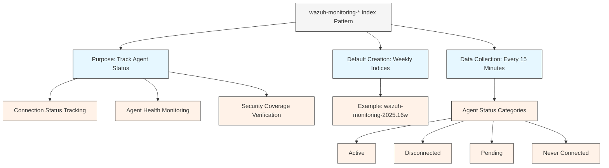
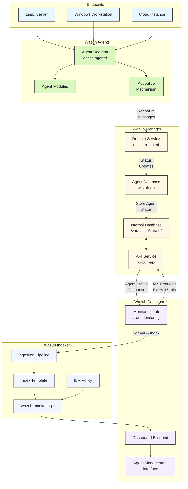
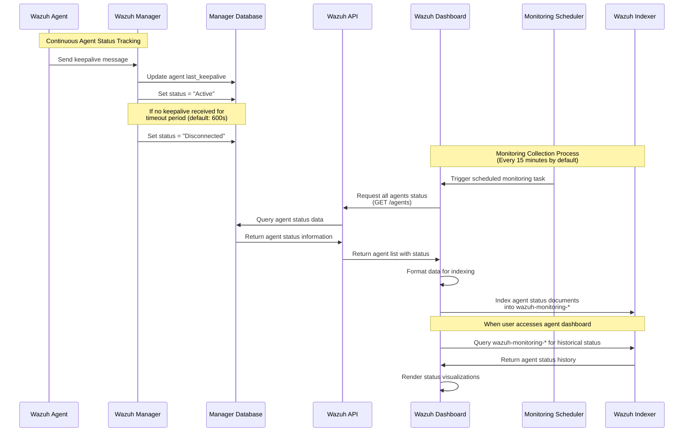
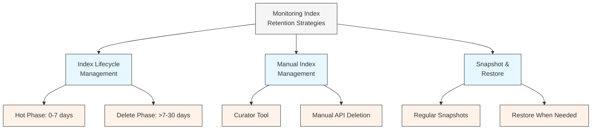
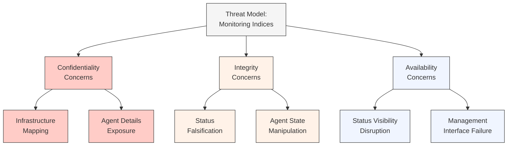
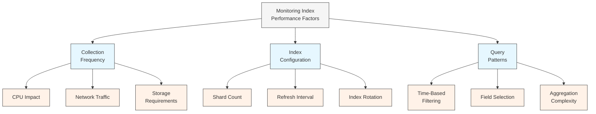
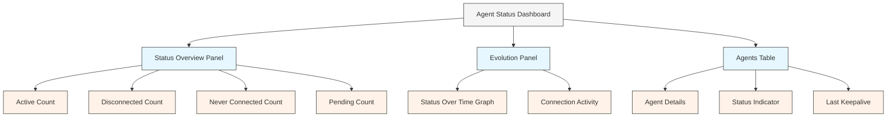

# Wazuh Monitoring Indices: Technical Architecture & Workflow

## Executive Summary

This technical document provides a comprehensive analysis of the `wazuh-monitoring-*` index pattern within the Wazuh security platform. This index pattern is critical for tracking and storing agent connection status information, enabling administrators to maintain visibility into the health and availability of their security monitoring infrastructure. The document details the architecture, data flow, schema structure, and operational considerations for effectively managing agent status monitoring in enterprise Wazuh deployments.

Understanding the `wazuh-monitoring-*` index pattern is essential for security operations teams to ensure continuous coverage, quickly identify disconnected agents, and maintain the integrity of their security monitoring footprint. This document serves as a technical reference for security architects, administrators, and analysts responsible for Wazuh infrastructure in corporate environments.

## Table of Contents

1. [Introduction](#introduction)
2. [Monitoring Index Overview](#monitoring-index-overview)
3. [System Architecture](#system-architecture)
4. [Agent Status Monitoring Workflow](#agent-status-monitoring-workflow)
5. [Index Structure & Schema](#index-structure--schema)
6. [Configuration Options](#configuration-options)
7. [Storage & Retention Considerations](#storage--retention-considerations)
8. [Security Implications](#security-implications)
9. [Performance Optimization](#performance-optimization)
10. [Use Cases & Visualizations](#use-cases--visualizations)
11. [Troubleshooting Guide](#troubleshooting-guide)
12. [Conclusion](#conclusion)
13. [References](#references)

## Introduction

Agent monitoring is a critical component of any distributed security monitoring platform. In Wazuh, the health and connectivity status of agents deployed throughout the infrastructure must be continuously tracked to ensure comprehensive security coverage. The `wazuh-monitoring-*` index pattern fulfills this essential requirement by storing historical data about agent connection states.

Unlike event or alert indices that store security-related content, the monitoring indices focus exclusively on the operational status of the Wazuh agents themselves. This separation of concerns allows Wazuh to provide robust agent management capabilities while maintaining efficient storage and retrieval of security events.

This document explores the technical architecture behind the `wazuh-monitoring-*` index pattern, providing security professionals with detailed insights into how Wazuh tracks agent status throughout the agent lifecycle.

## Monitoring Index Overview

The `wazuh-monitoring-*` index pattern stores the connection status history of all Wazuh agents enrolled in the platform. This specialized index allows Wazuh to maintain a time-series record of agent availability, enabling both real-time monitoring and historical analysis of agent connectivity.



### Key Characteristics

1. **Purpose**: Tracks the connection status of Wazuh agents over time, providing visibility into agent availability and health.

2. **Data Collection**: By default, agent status information is collected and indexed every 15 minutes.

3. **Index Rotation**: The Wazuh indexer creates weekly indices by default, following the naming convention `wazuh-monitoring-YYYY.WWw` (e.g., `wazuh-monitoring-2025.16w` for the 16th week of 2025).

4. **Agent States**: The index stores one of four possible connection states for each agent:
   - **Active**: Agent is properly connected and sending data
   - **Disconnected**: Agent was previously connected but is no longer communicating
   - **Pending**: Agent has been registered but has not yet connected
   - **Never connected**: Agent has been registered but has never established a connection

5. **Dashboard Integration**: The Wazuh dashboard uses these indices to provide agent status visualizations in the Agents Management section.

## System Architecture

The monitoring of agent status involves several components working together across the Wazuh platform:



### Key Components

1. **Wazuh Agents**: Deployed on endpoints to collect security data and report status
   - **Agent Daemon (ossec-agentd)**: Main process that manages agent operations
   - **Keepalive Mechanism**: Sends periodic heartbeat messages to the manager

2. **Wazuh Manager**: Central server that tracks agent connections
   - **Remote Service (ossec-remoted)**: Receives agent communications including keepalives
   - **Agent Database (wazuh-db)**: Stores agent information including status
   - **API Service**: Provides endpoints to query agent status information
   - **Internal Database**: SQLite databases storing agent data

3. **Wazuh Dashboard**: Responsible for collecting and visualizing agent status
   - **Monitoring Job**: Scheduled task that polls the Wazuh API for agent status
   - **Dashboard Backend**: Processes and formats status data for indexing
   - **Agent Management Interface**: Visualizes agent status information

4. **Wazuh Indexer**: Stores agent status data in searchable indices
   - **Ingestion Pipeline**: Processes incoming agent status documents
   - **Index Template**: Defines mapping for monitoring fields
   - **wazuh-monitoring-\***: Stores agent status snapshots
   - **ILM Policy**: Manages monitoring index lifecycle

## Agent Status Monitoring Workflow

The following sequence diagram illustrates how agent status data flows through the Wazuh system to be stored in the `wazuh-monitoring-*` index pattern:



### Workflow Stages

1. **Status Determination**
   - Wazuh agents send periodic keepalive messages to the manager
   - Default keepalive interval: 60 seconds (configurable in `ossec.conf`)
   - Manager maintains a timestamp of the last received keepalive for each agent
   - If no keepalive is received within the timeout period (default: 600 seconds):
     - Agent status changes from "Active" to "Disconnected"
   - Status information is stored in the manager's internal database

2. **Status Collection**
   - The Wazuh dashboard runs a scheduled monitoring task every 15 minutes by default
   - This task is configured in the dashboard's `wazuh.yml` configuration
   - The monitoring job queries the Wazuh API for current agent status
   - The API endpoint `/agents` returns a list of all agents with their current status

3. **Data Indexing**
   - The dashboard formats the API response into documents for indexing
   - Each document includes:
     - Agent identification (ID, name, IP, version)
     - Connection status (active, disconnected, pending, never_connected)
     - Timestamp of status collection
     - Additional metadata (OS, version, configuration, etc.)
   - Documents are indexed into the current `wazuh-monitoring-*` index
   - The index template ensures proper field mapping

4. **Status Visualization**
   - When users access the Agents Management section of the dashboard
   - The dashboard queries the `wazuh-monitoring-*` indices for historical status data
   - This data is presented as status indicators, timelines, and summary statistics

## Index Structure & Schema

The `wazuh-monitoring-*` indices follow a structured schema defined by the Wazuh index template. Each document represents a status snapshot of a specific agent at a point in time.

### Index Naming Convention

```
wazuh-monitoring-YYYY.WWw
```

Examples:
- `wazuh-monitoring-2025.16w` (16th week of 2025)
- `wazuh-monitoring-2025.17w` (17th week of 2025)

### Document Schema

The monitoring index documents contain fields that provide detailed information about agent status and configuration:

| Field | Type | Description |
|-------|------|-------------|
| `@timestamp` | date | Time when the status snapshot was taken |
| `id` | keyword | Unique identifier of the agent |
| `status` | keyword | Connection status: "Active", "Disconnected", "Pending", "Never connected" |
| `ip` | ip | IP address of the agent |
| `name` | keyword | Hostname or name of the agent |
| `dateAdd` | date | Date when the agent was added to the manager |
| `version` | keyword | Wazuh agent version |
| `manager` | keyword | Name of the Wazuh manager |
| `os.name` | keyword | Operating system name |
| `os.version` | keyword | Operating system version |
| `os.arch` | keyword | System architecture |
| `lastKeepAlive` | date | Timestamp of the last keepalive received |
| `group` | keyword | Agent group membership |
| `mergedSum` | keyword | MD5 checksum of the agent's merged configuration |
| `configSum` | keyword | MD5 checksum of the agent's configuration |
| `node_name` | keyword | Name of the cluster node (if clustering enabled) |
| `registerIP` | ip | IP address used during registration |

### Sample Document

```json
{
  "@timestamp": "2025-04-17T12:00:00.000Z",
  "id": "001",
  "name": "web-server-01",
  "ip": "10.0.1.15",
  "status": "Active",
  "dateAdd": "2024-12-01T09:23:45.123Z",
  "version": "4.4.0",
  "manager": "wazuh-manager",
  "os": {
    "name": "Ubuntu",
    "version": "22.04.2 LTS",
    "arch": "x86_64"
  },
  "lastKeepAlive": "2025-04-17T11:59:05.432Z",
  "group": ["linux", "web-servers"],
  "mergedSum": "84a7c64f35f35fdb2d42c4a6983c43b1",
  "configSum": "f7c0b13a6b2a606ff9e2e4933d9d2a45",
  "node_name": "master-node",
  "registerIP": "10.0.1.15"
}
```

## Configuration Options

The behavior of the agent monitoring system and the `wazuh-monitoring-*` indices can be customized through various configuration options.

### Dashboard Configuration

The monitoring task is configured in the Wazuh dashboard's configuration file (`/usr/share/wazuh-dashboard/data/wazuh/config/wazuh.yml`):

```yaml
# Agent monitoring
cron:
  monitoring:
    # Enable/disable the agent monitoring task
    status: true

    # Frequency of agent status collection (cron format)
    # Default: every 15 minutes
    frequency: '0 */15 * * * *'

    # Index pattern creation interval
    # Options: daily (d), weekly (w), monthly (m)
    index:
      creation: 'w'

    # Index storage settings
    index:
      shards: 2
      replicas: 0
```

### Important Configuration Parameters

1. **Monitoring Status**:
   - `cron.monitoring.status`: Enable/disable the agent monitoring task
   - When set to `false`, no agent status data will be collected or indexed

2. **Collection Frequency**:
   - `cron.monitoring.frequency`: How often agent status is collected
   - Uses cron syntax (`0 */15 * * * *` = every 15 minutes)
   - Increasing frequency provides more granular status data but uses more storage
   - Decreasing frequency reduces storage requirements but decreases status resolution

3. **Index Creation Interval**:
   - `cron.monitoring.index.creation`: Controls how often new indices are created
   - Options: `d` (daily), `w` (weekly), `m` (monthly)
   - Default: weekly indices

4. **Index Structure**:
   - `cron.monitoring.index.shards`: Number of primary shards for monitoring indices
   - `cron.monitoring.index.replicas`: Number of replica shards
   - Default: 2 shards, 0 replicas (adjust based on cluster size)

### Agent Connection Configuration

The agent connection parameters that affect status determination are configured in the manager's `ossec.conf`:

```xml
<ossec_config>
  <global>
    <!-- Disconnection timeout in seconds (10 minutes default) -->
    <agent_disconnection_time>600</agent_disconnection_time>

    <!-- Time to mark an agent as 'Never connected' (1 hour default) -->
    <agent_connection_time>3600</agent_connection_time>
  </global>
</ossec_config>
```

## Storage & Retention Considerations

Properly managing the storage and retention of monitoring indices is essential for balancing operational visibility with resource utilization.

### Storage Requirements

Storage requirements for the `wazuh-monitoring-*` indices depend on several factors:

| Factor | Impact |
|--------|--------|
| Number of agents | Linear increase in storage requirements |
| Collection frequency | More frequent collection = more documents |
| Document size | Depends on agent metadata included |
| Index rotation | Weekly indices consolidate documents |
| Retention period | Longer retention = more indices |

#### Typical Storage Calculations

For a deployment with:
- 100 agents
- 15-minute collection interval
- ~1KB per document
- Weekly index rotation
- 30-day retention

Approximate storage:
- Documents per day: 100 agents × 24 hours × 4 collections/hour = 9,600 documents
- Storage per day: 9,600 documents × 1KB = ~9.6MB
- Storage per week: ~67MB
- Storage per month: ~288MB

### Retention Strategies



1. **Index Lifecycle Management (ILM)**:
   - Define policies to automatically manage monitoring indices
   - Typical policy for monitoring indices:
     - Hot phase: 0-7 days (active querying)
     - Delete phase: >7 days (remove old indices)
   - Configure via Elasticsearch/OpenSearch ILM APIs

2. **Manual Index Management**:
   - Use Curator tool or scripts to delete old indices
   - API-based deletion of indices older than a certain date
   - Example API call:
     ```
     DELETE /wazuh-monitoring-*,-wazuh-monitoring-${current_week}
     ```

3. **Recommended Retention Periods**:
   - Minimum: 7 days (for basic troubleshooting)
   - Standard: 30 days (for operational visibility)
   - Extended: 90 days (for trend analysis)
   - Compliance-driven: Depends on requirements (some regulations require 1 year+)

## Security Implications

The `wazuh-monitoring-*` indices contain valuable information about the security monitoring infrastructure that requires appropriate protection.

### Threat Model



### Security Considerations

1. **Information Disclosure Risks**:
   - Monitoring indices contain network topology information
   - Agent details (OS, version, IPs) could aid attackers in targeting
   - Agent status changes could reveal security operations activity

2. **Access Control Recommendations**:
   - Implement role-based access control for monitoring indices
   - Restrict read access to security personnel only
   - Example Elasticsearch role:
     ```json
     {
       "indices": [
         {
           "names": ["wazuh-monitoring-*"],
           "privileges": ["read"]
         }
       ]
     }
     ```

3. **Data Protection**:
   - Enable TLS encryption for all indexer communications
   - Consider encryption at rest for sensitive indices
   - Implement network segmentation for indexer cluster

4. **Operational Security**:
   - Monitor abnormal query patterns against monitoring indices
   - Detect and alert on unusual agent status changes
   - Implement audit logging for index access

## Performance Optimization

Optimizing the performance of the monitoring indices ensures efficient agent status tracking while minimizing resource consumption.

### Performance Factors



### Optimization Recommendations

1. **Collection Frequency Tuning**:
   - Default (15 minutes) is suitable for most deployments
   - Large deployments (1000+ agents): Consider 30-minute intervals
   - Critical infrastructure: 5-minute intervals may be appropriate
   - Balance between operational visibility and resource utilization

2. **Index Structure Optimization**:
   - Adjust shard count based on cluster size:
     - Small deployments (<500 agents): 1-2 shards
     - Medium deployments (500-2000 agents): 2-3 shards
     - Large deployments (>2000 agents): 3-5 shards
   - Set appropriate refresh interval:
     - Default (1s) is fine for most deployments
     - Consider increasing to 5-10s for very large deployments

3. **Query Optimization**:
   - Use date ranges when querying historical status data
   - Select specific fields rather than retrieving entire documents
   - Leverage aggregations for status summaries
   - Example optimized query:
     ```json
     {
       "_source": ["status", "name", "ip", "lastKeepAlive"],
       "query": {
         "bool": {
           "must": [
             {"term": {"status": "Disconnected"}},
             {"range": {"@timestamp": {"gte": "now-24h"}}}
           ]
         }
       }
     }
     ```

## Use Cases & Visualizations

The `wazuh-monitoring-*` indices support several critical use cases and visualizations within the Wazuh dashboard.

### Agent Status Dashboard

The primary visualization is the Agent Status dashboard, available via Agents Management > Summary:



### Key Use Cases

1. **Security Coverage Verification**:
   - Ensuring all critical systems have active agents
   - Identifying systems without monitoring coverage
   - Tracking agent deployment progress during rollouts

2. **Agent Health Monitoring**:
   - Detecting agents that have disconnected unexpectedly
   - Identifying patterns of agent disconnections
   - Monitoring agent version distribution

3. **Operational Reporting**:
   - Generating compliance reports on monitoring coverage
   - Tracking security monitoring metrics over time
   - Providing evidence for security audits

4. **Troubleshooting**:
   - Investigating agent connectivity issues
   - Correlating agent disconnections with infrastructure changes
   - Identifying problematic agent configurations

### Sample Dashboard Queries

1. **Recently Disconnected Agents**:
   ```
   status:Disconnected AND @timestamp:[now-24h TO now]
   ```

2. **Agents Never Connected**:
   ```
   status:"Never connected" AND dateAdd:[now-7d TO now]
   ```

3. **Agents by Operating System**:
   ```
   status:Active AND os.name:*
   ```

## Troubleshooting Guide

### Common Issues & Solutions

#### Missing Agent Status Data

```
Symptom: Agent status not updating in dashboard or "No results found" in monitoring view

Troubleshooting Steps:
1. Check monitoring task status:
   $ grep -A 10 "monitoring" /usr/share/wazuh-dashboard/data/wazuh/config/wazuh.yml

2. Verify index exists:
   $ curl -k -u <username>:<password> "https://localhost:9200/_cat/indices/wazuh-monitoring-*?v"

3. Check dashboard logs for monitoring task errors:
   $ tail -f /var/log/wazuh-dashboard/opensearch-dashboards.log | grep monitoring

4. Verify API connectivity:
   $ curl -k -u <username>:<password> "https://localhost:55000/agents?limit=1"

Solutions:
- Enable monitoring task (cron.monitoring.status: true)
- Restart dashboard service
- Check API credentials and connectivity
- Verify manager is correctly tracking agent status
```

#### Incorrect Agent Status

```
Symptom: Agent shows incorrect status (e.g., "Active" when actually disconnected)

Troubleshooting Steps:
1. Check agent keepalive settings in ossec.conf:
   $ grep "<keepalive>" /var/ossec/etc/ossec.conf

2. Verify agent_disconnection_time setting:
   $ grep "agent_disconnection_time" /var/ossec/etc/ossec.conf

3. Check agent connection directly via API:
   $ curl -k -u <username>:<password> "https://localhost:55000/agents/<agent_id>"

4. Examine agent logs for connectivity issues:
   $ tail -f /var/ossec/logs/ossec.log | grep "Agent connection"

Solutions:
- Adjust agent_disconnection_time if needed
- Restart agent to re-establish connection
- Check network connectivity between agent and manager
- Verify time synchronization across infrastructure
```

#### Performance Issues

```
Symptom: Slow agent status dashboard loading or high resource usage during monitoring

Troubleshooting Steps:
1. Check index size and document count:
   $ curl -k -u <username>:<password> "https://localhost:9200/_cat/indices/wazuh-monitoring-*?v&h=index,docs.count,store.size"

2. Review monitoring collection frequency:
   $ grep "frequency" /usr/share/wazuh-dashboard/data/wazuh/config/wazuh.yml

3. Check indexer performance metrics:
   $ curl -k -u <username>:<password> "https://localhost:9200/_nodes/stats"

Solutions:
- Reduce monitoring collection frequency (e.g., from 15 to 30 minutes)
- Implement index lifecycle management policies
- Optimize shard count based on cluster size
- Increase refresh interval for monitoring indices
```

## Conclusion

The `wazuh-monitoring-*` index pattern is a critical component of the Wazuh security platform, providing essential visibility into agent status and health. By storing historical agent connection information, these indices enable administrators to:

1. **Maintain awareness** of the security coverage across their infrastructure
2. **Quickly identify** agents that have disconnected or are experiencing issues
3. **Track the evolution** of agent status over time
4. **Ensure complete coverage** of security monitoring across the enterprise

For enterprise deployments, proper management of the monitoring indices is essential for operational efficiency and security visibility. By following the architectural principles, configuration recommendations, and optimization strategies outlined in this document, organizations can effectively maintain visibility into their agent fleet while minimizing resource utilization.

The monitoring indices complement the other Wazuh index patterns (alerts, archives, statistics, and vulnerabilities) to provide a comprehensive security monitoring solution. While alerts and archives focus on security events, the monitoring indices ensure that the security monitoring infrastructure itself remains healthy and operational.

## References

1. [Wazuh Documentation - Wazuh Indexer Indices](https://documentation.wazuh.com/current/user-manual/elasticsearch/indices.html)
2. [Wazuh Documentation - Agent Enrollment and Connection](https://documentation.wazuh.com/current/user-manual/agents/agent-enrollment.html)
3. [Wazuh Documentation - Dashboard Configuration](https://documentation.wazuh.com/current/user-manual/wazuh-dashboard/config-file.html)
4. [Elasticsearch Documentation - Index Lifecycle Management](https://www.elastic.co/guide/en/elasticsearch/reference/current/index-lifecycle-management.html)
5. [Wazuh Documentation - Agent Monitoring API](https://documentation.wazuh.com/current/user-manual/api/reference.html#agents)
6. [Wazuh Documentation - Agent Management Interface](https://documentation.wazuh.com/current/user-manual/wazuh-dashboard/agents.html)
7. [Wazuh Documentation - Cluster Configuration](https://documentation.wazuh.com/current/user-manual/manager/cluster.html)
