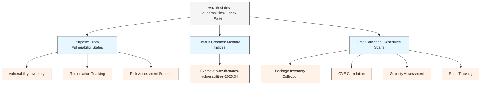
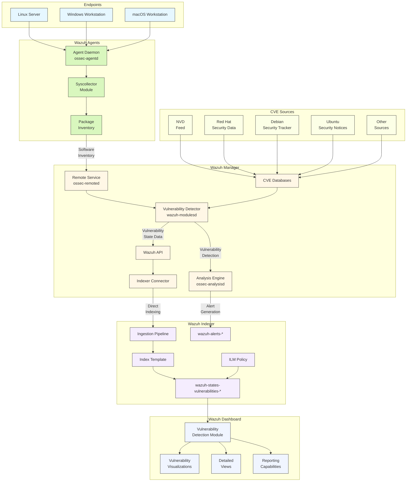
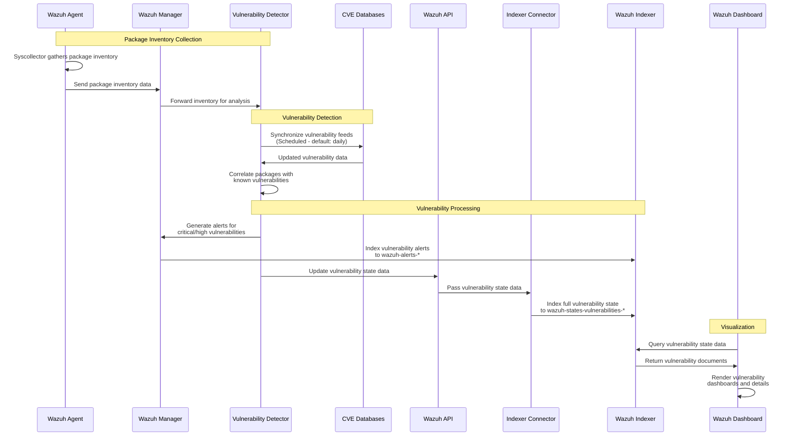
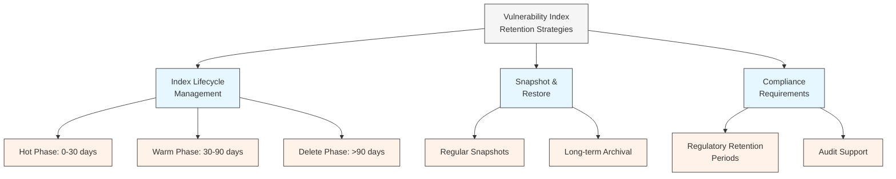
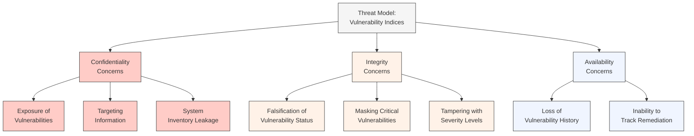
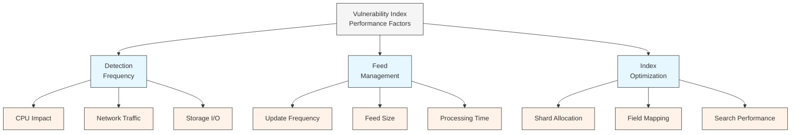
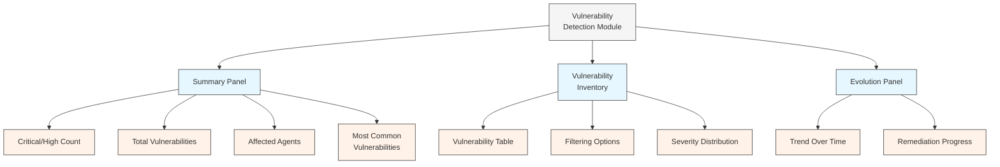

# Wazuh Vulnerability States Indices: Technical Architecture & Workflow

## Executive Summary

> [!SUMMARY]
> This technical document provides a comprehensive analysis of the `wazuh-states-vulnerabilities-*` index pattern within the [[Wazuh]] security platform. These indices are critical for storing, tracking, and analyzing vulnerability data detected across the monitored infrastructure. The document details the complete architecture, data flow, and operational considerations necessary for effectively managing vulnerability detection and remediation in enterprise Wazuh deployments.
>
> Understanding the vulnerability state indices is essential for security teams to identify, prioritize, and remediate security vulnerabilities across their infrastructure. This document serves as a technical reference for security architects, administrators, and analysts responsible for vulnerability management in corporate environments, providing detailed insights into how Wazuh processes and stores vulnerability data to support effective security operations.

## Table of Contents

1. [[#Introduction]]
2. [[#Vulnerability States Index Overview]]
3. [[#System Architecture]]
4. [[#Vulnerability Detection Workflow]]
5. [[#Index Structure & Schema]]
6. [[#Configuration Options]]
7. [[#Storage & Retention Considerations]]
8. [[#Security Implications]]
9. [[#Performance Optimization]]
10. [[#Use Cases & Visualizations]]
11. [[#Troubleshooting Guide]]
12. [[#Conclusion]]
13. [[#References]]

## Introduction

[[Vulnerability Management]] is a critical component of any comprehensive security program. [[Wazuh]] provides built-in vulnerability detection capabilities that scan monitored endpoints for known security vulnerabilities in installed software packages. This functionality helps organizations identify vulnerable systems before they can be exploited by threat actors.

The `wazuh-states-vulnerabilities-*` index pattern is dedicated to storing detailed information about detected vulnerabilities, their severity, affected packages, and remediation status. Unlike [[Wazuh Alert Indices|event or alert indices]] that focus on security incidents, the vulnerability state indices maintain a comprehensive inventory of all vulnerabilities present in the monitored environment, providing a foundation for effective vulnerability management.

This document explores the technical architecture behind the `wazuh-states-vulnerabilities-*` index pattern, providing security professionals with detailed insights into how Wazuh detects, processes, and stores vulnerability data throughout the vulnerability management lifecycle.

## Vulnerability States Index Overview

The `wazuh-states-vulnerabilities-*` index pattern stores the state of vulnerabilities detected across all monitored endpoints in the Wazuh deployment. This specialized index allows Wazuh to maintain a comprehensive inventory of vulnerabilities, enabling both point-in-time assessment and historical trend analysis.



### Key Characteristics

1. **Purpose**: Stores and tracks vulnerabilities detected in the software inventory of monitored endpoints.

2. **Data Collection**: Vulnerability data is collected through scheduled scans performed by the [[Vulnerability Detector]] module on the [[Wazuh Manager]].

3. **Index Rotation**: The [[Wazuh Indexer]] creates monthly indices by default, following the naming convention `wazuh-states-vulnerabilities-YYYY.MM` (e.g., `wazuh-states-vulnerabilities-2025.04` for April 2025).

4. **Vulnerability States**: The index tracks several attributes for each vulnerability:
   - **CVE ID**: Common Vulnerabilities and Exposures identifier
   - **Severity**: Risk level (Critical, High, Medium, Low)
   - **Affected Package**: Software package containing the vulnerability
   - **Status**: Current state (e.g., Active, Fixed, Pending)
   - **System Details**: Agent and endpoint information

5. **Dashboard Integration**: The [[Wazuh Dashboard]] uses these indices to provide vulnerability visualizations in the Vulnerability Detection section.

## System Architecture

The vulnerability detection and tracking system involves several components working together across the Wazuh platform:



### Key Components

1. **[[Wazuh Agent|Wazuh Agents]]**: Deployed on endpoints to collect package inventory data
   - **[[Syscollector]] Module**: Gathers information about installed packages
   - **Package Inventory**: Lists of installed software with version information

2. **[[Wazuh Manager]]**: Central server that performs vulnerability detection
   - **[[Vulnerability Detector]]**: Module that correlates package data with known vulnerabilities
   - **CVE Databases**: Local copies of vulnerability feeds from multiple sources
   - **[[Analysis Engine]] ([[ossec-analysisd]])**: Generates alerts for detected vulnerabilities
   - **[[Indexer Connector]]**: Directly indexes vulnerability state data

3. **CVE Sources**: External vulnerability databases that Wazuh synchronizes
   - **[[National Vulnerability Database|National Vulnerability Database (NVD)]]**: Comprehensive US government database
   - **Vendor-Specific Sources**: Red Hat, Debian, Ubuntu, etc.
   - **Additional Sources**: Depending on configured providers

4. **[[Wazuh Indexer]]**: Stores vulnerability data in searchable indices
   - **Ingestion Pipeline**: Processes incoming vulnerability documents
   - **Index Template**: Defines mapping for vulnerability fields
   - **wazuh-states-vulnerabilities-\***: Stores vulnerability state data
   - **wazuh-alerts-\***: Stores alerts generated by vulnerability findings
   - **[[ILM Policy|ILM Policy]]**: Manages vulnerability index lifecycle

5. **[[Wazuh Dashboard]]**: Visualizes vulnerability data
   - **Vulnerability Detection Module**: Dedicated interface for vulnerability management
   - **Vulnerability Visualizations**: Summary dashboards and trends
   - **Detailed Views**: In-depth examination of specific vulnerabilities
   - **Reporting Capabilities**: Generation of vulnerability reports

## Vulnerability Detection Workflow

The following sequence diagram illustrates how vulnerability data flows through the Wazuh system to be stored in the `wazuh-states-vulnerabilities-*` index pattern:



### Workflow Stages

1. **Package Inventory Collection**
   - [[Wazuh Agent|Wazuh agents]] collect information about installed packages on endpoints
   - The [[Syscollector]] module runs periodically (default: every 12 hours)
   - Package data includes name, version, architecture, and source
   - This inventory is sent to the [[Wazuh Manager]]

2. **Vulnerability Feed Management**
   - The [[Vulnerability Detector]] module periodically synchronizes with CVE sources
   - Default update frequency is daily, but can be configured
   - Sources include [[National Vulnerability Database|NVD]], Red Hat, Debian, Ubuntu, and others
   - Local copies of vulnerability databases are maintained on the manager

3. **Vulnerability Detection Process**
   - When new package data is received or on scheduled runs
   - The [[Vulnerability Detector]] correlates package inventory with known vulnerabilities
   - For each vulnerable package, the module:
     - Identifies the CVE ID
     - Determines severity based on [[CVSS]] score
     - Extracts affected and fixed versions
     - Creates a vulnerability state record

4. **Dual-Path Data Flow**
   - **Alert Path**: For significant findings (high/critical by default)
     - Alerts are generated and processed by the Analysis Engine
     - These alerts are indexed into `wazuh-alerts-*` like other security events
   - **State Path**: For all vulnerabilities (regardless of severity)
     - Complete vulnerability state data is sent via the API
     - The Indexer Connector sends this data directly to the Wazuh Indexer
     - Data is indexed into the `wazuh-states-vulnerabilities-*` indices

5. **State Tracking**
   - The system maintains the current state of each vulnerability
   - When packages are updated, new scans identify fixed vulnerabilities
   - The state is updated accordingly in the index
   - This creates a historical record of vulnerability remediation

## Index Structure & Schema

The `wazuh-states-vulnerabilities-*` indices follow a structured schema defined by the Wazuh index template. Each document represents a specific vulnerability found on a specific agent.

### Index Naming Convention

> [!INFO]
> ```
> wazuh-states-vulnerabilities-YYYY.MM
> ```
>
> Examples:
> - `wazuh-states-vulnerabilities-2025.04` (April 2025)
> - `wazuh-states-vulnerabilities-2025.05` (May 2025)

### Document Schema

The vulnerability state documents contain fields that provide detailed information about detected vulnerabilities:

| Field | Type | Description |
|-------|------|-------------|
| `agent.id` | keyword | Unique identifier of the agent |
| `agent.name` | keyword | Hostname or name of the agent |
| `vulnerability.cve` | keyword | CVE identifier |
| `vulnerability.package.name` | keyword | Name of the vulnerable package |
| `vulnerability.package.version` | keyword | Installed version of the package |
| `vulnerability.package.architecture` | keyword | Architecture of the package |
| `vulnerability.package.condition` | text | Version comparison condition |
| `vulnerability.severity` | keyword | Severity level (Critical, High, Medium, Low, None) |
| `vulnerability.cvss.cvss2.base_score` | float | CVSS v2 base score (if available) |
| `vulnerability.cvss.cvss3.base_score` | float | CVSS v3 base score (if available) |
| `vulnerability.title` | text | Brief title of the vulnerability |
| `vulnerability.description` | text | Detailed description of the vulnerability |
| `vulnerability.published` | date | Date when the vulnerability was published |
| `vulnerability.updated` | date | Date when the vulnerability information was last updated |
| `vulnerability.references` | keyword | List of reference URLs |
| `vulnerability.status` | keyword | Current status (Active, Fixed, etc.) |
| `vulnerability.state` | keyword | Additional state information |
| `vulnerability.detection_time` | date | Time when the vulnerability was first detected |
| `@timestamp` | date | Time when the document was indexed |
| `vulnerability.external_references` | keyword | External identifiers (CWE, etc.) |
| `vulnerability.assigner` | keyword | Organization that assigned the CVE |

### Sample Document

> [!EXAMPLE] Vulnerability Document
> ```json
> {
>   "@timestamp": "2025-04-17T14:30:00.000Z",
>   "agent": {
>     "id": "001",
>     "name": "web-server-01",
>     "ip": "10.0.1.15"
>   },
>   "vulnerability": {
>     "cve": "CVE-2025-1234",
>     "package": {
>       "name": "openssl",
>       "version": "1.1.1k-1",
>       "architecture": "amd64",
>       "condition": "< 1.1.1l-1"
>     },
>     "severity": "High",
>     "cvss": {
>       "cvss3": {
>         "base_score": 7.8,
>         "vector": "CVSS:3.1/AV:N/AC:L/PR:N/UI:N/S:U/C:H/I:N/A:L"
>       },
>       "cvss2": {
>         "base_score": 6.8,
>         "vector": "AV:N/AC:M/Au:N/C:P/I:P/A:P"
>       }
>     },
>     "title": "OpenSSL: Potential DoS vulnerability in TLS certificate validation",
>     "description": "A flaw was found in OpenSSL where certificate verification could enter an infinite loop, consuming CPU and preventing the connection from being established.",
>     "published": "2025-03-15T10:00:00.000Z",
>     "updated": "2025-03-20T14:00:00.000Z",
>     "references": [
>       "https://nvd.nist.gov/vuln/detail/CVE-2025-1234",
>       "https://www.openssl.org/news/secadv/20250315.txt"
>     ],
>     "status": "Active",
>     "detection_time": "2025-04-16T09:15:30.000Z",
>     "external_references": {
>       "cwe": ["CWE-835"]
>     },
>     "assigner": "security@openssl.org"
>   },
>   "manager": {
>     "name": "wazuh-manager"
>   }
> }
> ```

## Configuration Options

The behavior of the vulnerability detection system and the `wazuh-states-vulnerabilities-*` indices can be customized through various configuration options.

### Vulnerability Detector Configuration

> [!NOTE]
> The Vulnerability Detector module is configured in the Wazuh manager's `ossec.conf` file:
>
> ```xml
> <ossec_config>
>   <vulnerability-detector>
>     <!-- Enable/disable the module -->
>     <enabled>yes</enabled>
>
>     <!-- Time between vulnerability detection executions -->
>     <interval>12h</interval>
>
>     <!-- Run at start -->
>     <run_on_start>yes</run_on_start>
>
>     <!-- Minimum severity to report -->
>     <min_full_scan_severity>low</min_full_scan_severity>
>
>     <!-- Ignore not fixable CVEs -->
>     <ignore_unfixable>yes</ignore_unfixable>
>
>     <!-- Configure feeds -->
>     <provider name="canonical">
>       <enabled>yes</enabled>
>       <os>trusty</os>
>       <os>xenial</os>
>       <os>bionic</os>
>       <os>focal</os>
>       <os>jammy</os>
>       <update_interval>24h</update_interval>
>     </provider>
>
>     <provider name="debian">
>       <enabled>yes</enabled>
>       <os>stretch</os>
>       <os>buster</os>
>       <os>bullseye</os>
>       <update_interval>24h</update_interval>
>     </provider>
>
>     <provider name="redhat">
>       <enabled>yes</enabled>
>       <update_interval>24h</update_interval>
>     </provider>
>
>     <provider name="nvd">
>       <enabled>yes</enabled>
>       <update_interval>24h</update_interval>
>       <!-- NVD API key for better performance -->
>       <api_key>YOUR_API_KEY</api_key>
>     </provider>
>   </vulnerability-detector>
> </ossec_config>
> ```

### Indexer Connector Configuration

> [!NOTE]
> The Wazuh Indexer Connector is configured in the Wazuh manager's `ossec.conf` file:
>
> ```xml
> <ossec_config>
>   <indexer>
>     <!-- Enable/disable the connector -->
>     <enabled>yes</enabled>
>
>     <!-- Wazuh indexer URL -->
>     <url>https://localhost:9200</url>
>
>     <!-- Indexer type (opensearch or elasticsearch) -->
>     <type>opensearch</type>
>
>     <!-- Connection timeout -->
>     <timeout>60</timeout>
>
>     <!-- Authentication method -->
>     <username>elastic</username>
>     <password>password</password>
>
>     <!-- TLS verification -->
>     <ssl_verify>yes</ssl_verify>
>     <ssl_ca_file>/path/to/ca.pem</ssl_ca_file>
>
>     <!-- Connection retries -->
>     <max_retries>10</max_retries>
>     <retry_sleep>0.2</retry_sleep>
>   </indexer>
> </ossec_config>
> ```

### Index Configuration

> [!NOTE]
> The vulnerability state indices can be configured through the Wazuh dashboard's configuration file (`/usr/share/wazuh-dashboard/data/wazuh/config/wazuh.yml`):
>
> ```yaml
> # Vulnerability index settings
> vulnerability:
>   # Index creation interval (monthly by default)
>   index:
>     creation: 'm'
>
>   # Index storage settings
>   index:
>     shards: 3
>     replicas: 0
> ```

### Important Configuration Parameters

1. **Vulnerability Detection Settings**
   - `<enabled>`: Enable/disable the Vulnerability Detector module
   - `<interval>`: How often vulnerability detection runs
   - `<min_full_scan_severity>`: Minimum severity level to report
   - `<ignore_unfixable>`: Whether to skip vulnerabilities without fixes

2. **Feed Configuration**
   - `<provider>`: Configuration for each vulnerability feed
   - `<os>`: Operating system versions to include
   - `<update_interval>`: How often to update from the source

3. **Indexer Settings**
   - `<enabled>`: Enable/disable the indexer connector
   - `<url>`: Wazuh indexer endpoint
   - `<type>`: Indexer type (opensearch or elasticsearch)
   - `<max_retries>`: Retry attempts for failed connections

4. **Index Structure**
   - `vulnerability.index.creation`: Interval for new indices (d=daily, w=weekly, m=monthly)
   - `vulnerability.index.shards`: Number of primary shards
   - `vulnerability.index.replicas`: Number of replica shards

## Storage & Retention Considerations

Properly managing the storage and retention of vulnerability state indices is essential for balancing historical visibility with resource utilization.

### Storage Requirements

Storage requirements for the `wazuh-states-vulnerabilities-*` indices depend on several factors:

| Factor | Impact |
|--------|--------|
| Number of agents | Linear increase in storage requirements |
| Software diversity | More diverse software = more vulnerabilities |
| Scan frequency | More frequent scans = more state updates |
| Document size | ~2-5 KB per vulnerability instance |
| Index rotation | Monthly indices consolidate documents |
| Retention period | Longer retention = more indices |

#### Typical Storage Calculations

> [!EXAMPLE] Storage Calculation
> For a deployment with:
> - 100 agents
> - Average of 50 vulnerabilities per agent
> - Monthly index rotation
> - 90-day retention
>
> Approximate storage:
> - Documents per month: 100 agents × 50 vulnerabilities = 5,000 documents
> - Storage per month: 5,000 documents × 3KB (avg) = ~15MB
> - Storage for 90 days: ~45MB
>
> For larger deployments:
> - 1,000 agents with 50 vulnerabilities each: ~150MB per month
> - 10,000 agents with 50 vulnerabilities each: ~1.5GB per month

### Retention Strategies



1. **[[Index Lifecycle Management|Index Lifecycle Management (ILM)]]**:
   - Define policies to automatically manage vulnerability indices
   - Typical policy for vulnerability indices:
     - Hot phase: 0-30 days (active querying)
     - Warm phase: 30-90 days (less frequent access)
     - Delete phase: >90 days (remove old indices)
   - Configure via [[Elasticsearch]]/[[OpenSearch]] ILM APIs

2. **Snapshot & Restore**:
   - Create regular snapshots of vulnerability indices
   - Store snapshots in cost-effective storage
   - Restore as needed for historical analysis or audits
   - Implement automated snapshot rotation

3. **Recommended Retention Periods**:
   - **Operational**: 90 days (for remediation tracking)
   - **Compliance**: 365 days (for most regulatory requirements)
   - **Historical Analysis**: 2+ years (for long-term trend analysis)

4. **Advanced Strategies**
   - Consider index rollups for historical data
   - Implement tiered storage for older indices
   - Use cross-cluster replication for central vulnerability repositories

## Security Implications

> [!WARNING]
> The `wazuh-states-vulnerabilities-*` indices contain sensitive information about system vulnerabilities that requires appropriate protection.

### Threat Model



### Security Considerations

1. **Information Disclosure Risks**:
   - Vulnerability indices contain sensitive information about system weaknesses
   - Data includes detailed software inventory and version information
   - Unauthorized access could provide attackers with targeting information
   - Can reveal systems pending critical patches

2. **Access Control Recommendations**:
   - Implement strict [[Role-Based Access Control|role-based access control]] for vulnerability indices
   - Restrict read access to security personnel only
   - Example Elasticsearch role:
     ```json
     {
       "indices": [
         {
           "names": ["wazuh-states-vulnerabilities-*"],
           "privileges": ["read"]
         }
       ],
       "applications": [
         {
           "application": "wazuh-dashboard",
           "privileges": ["Vulnerability:read"],
           "resources": ["*"]
         }
       ]
     }
     ```

3. **Data Protection**:
   - Enable [[TLS]] encryption for all indexer communications
   - Consider [[Encryption at Rest|encryption at rest]] for vulnerability indices
   - Implement network segmentation for indexer cluster
   - Use secure and unique credentials for the indexer connector

4. **Operational Security**:
   - Monitor access to vulnerability indices
   - Implement audit logging for all vulnerability data access
   - Establish incident response procedures for unauthorized access

## Performance Optimization

Optimizing the performance of the vulnerability state indices ensures efficient vulnerability management while minimizing resource consumption.

### Performance Factors



### Optimization Recommendations

> [!TIP]
> Apply these optimization strategies based on your deployment size and requirements:

1. **Detection Frequency Tuning**:
   - Default (12-hour interval) is suitable for most deployments
   - Critical infrastructure: Consider 6-hour intervals
   - Development environments: Consider 24-hour intervals
   - Balance between timely detection and resource utilization
   - Consider staggering scans across agent groups

2. **Feed Management Optimization**:
   - Include only relevant OS versions in feed configuration
   - Use NVD API key to improve feed update performance
   - Schedule feed updates during off-hours
   - Consider hosting a local mirror for very large deployments

3. **Index Structure Optimization**:
   - Adjust shard count based on cluster size:
     - Small deployments (<500 agents): 1-2 shards
     - Medium deployments (500-2000 agents): 3-5 shards
     - Large deployments (>2000 agents): 5-7 shards
   - Use index aliases for consistent query targets
   - Consider custom mappings for specific fields

4. **Query Optimization**:
   - Use date ranges and filters when querying
   - Create custom aggregations for common reports
   - Leverage field collapsing for agent-grouped views
   - Example optimized query:
     ```json
     {
       "query": {
         "bool": {
           "must": [
             {"term": {"vulnerability.severity": "Critical"}},
             {"range": {"@timestamp": {"gte": "now-30d"}}}
           ],
           "must_not": [
             {"term": {"vulnerability.status": "Fixed"}}
           ]
         }
       },
       "sort": [
         {"vulnerability.cvss.cvss3.base_score": {"order": "desc"}}
       ],
       "collapse": {
         "field": "vulnerability.cve"
       }
     }
     ```

## Use Cases & Visualizations

The `wazuh-states-vulnerabilities-*` indices support several critical use cases and visualizations within the Wazuh dashboard.

### Vulnerability Dashboard

The primary visualization is the Vulnerability Detection dashboard, available from the Wazuh dashboard home page:



### Key Use Cases

1. **Vulnerability Assessment**:
   - Identifying vulnerable systems across the infrastructure
   - Prioritizing remediation based on severity and impact
   - Generating comprehensive vulnerability reports

2. **Remediation Tracking**:
   - Monitoring progress of vulnerability patching
   - Verifying that critical vulnerabilities are addressed
   - Tracking mean time to remediation (MTTR)

3. **Compliance Reporting**:
   - Generating reports for regulatory compliance
   - Providing evidence for security audits
   - Demonstrating vulnerability management practices

4. **Risk Assessment**:
   - Evaluating overall security posture
   - Identifying systems with highest vulnerability density
   - Tracking vulnerability trends over time

5. **Patch Management Support**:
   - Identifying systems requiring specific patches
   - Verifying patch effectiveness
   - Providing feedback to patch management processes

### Sample Dashboard Queries

> [!EXAMPLE] Critical Vulnerabilities
> ```
> vulnerability.severity:Critical AND NOT vulnerability.status:Fixed
> ```

> [!EXAMPLE] Recently Fixed Vulnerabilities
> ```
> vulnerability.status:Fixed AND @timestamp:[now-7d TO now]
> ```

> [!EXAMPLE] Specific Package Vulnerabilities
> ```
> vulnerability.package.name:openssl AND vulnerability.severity:(Critical OR High)
> ```

> [!EXAMPLE] CVSS Score Filtering
> ```
> vulnerability.cvss.cvss3.base_score:>=7.0
> ```

## Troubleshooting Guide

### Common Issues & Solutions

#### Missing Vulnerability Data

> [!FAILURE]
> **Symptom**: No vulnerability data in indices or "No results found" in vulnerability dashboard
>
> **Troubleshooting Steps**:
> 1. Check Vulnerability Detector status:
>    ```bash
>    $ grep -A 20 "vulnerability-detector" /var/ossec/etc/ossec.conf
>    ```
>
> 2. Verify module is running:
>    ```bash
>    $ ps -ef | grep wazuh-modulesd | grep vulnerability
>    ```
>
> 3. Check feed updates:
>    ```bash
>    $ grep "vulnerability-detector" /var/ossec/logs/ossec.log | grep feed
>    ```
>
> 4. Verify syscollector is sending inventory:
>    ```bash
>    $ grep "syscollector" /var/ossec/logs/ossec.log
>    ```
>
> **Solutions**:
> - Enable Vulnerability Detector (`<enabled>yes</enabled>`)
> - Trigger a manual scan: `/var/ossec/bin/wazuh-control vulnerability-detector restart`
> - Verify feed sources are properly configured
> - Check agent configuration for syscollector

#### Feed Update Issues

> [!FAILURE]
> **Symptom**: Error messages about feed updates or outdated vulnerability information
>
> **Troubleshooting Steps**:
> 1. Check feed update logs:
>    ```bash
>    $ grep "vulnerability-detector: ERROR" /var/ossec/logs/ossec.log
>    ```
>
> 2. Verify feed files exist:
>    ```bash
>    $ ls -la /var/ossec/queue/vulnerabilities/
>    ```
>
> 3. Check internet connectivity:
>    ```bash
>    $ curl -I https://nvd.nist.gov/feeds/json/cve/1.1/nvdcve-1.1-recent.json.gz
>    ```
>
> 4. Verify disk space:
>    ```bash
>    $ df -h /var/ossec/
>    ```
>
> **Solutions**:
> - Add NVD API key for better reliability
> - Configure proxy settings if needed
> - Increase feed update timeouts
> - Free disk space if necessary
> - Manually download and place feed files

#### Performance Issues

> [!FAILURE]
> **Symptom**: High CPU usage during vulnerability scans or slow dashboard loading
>
> **Troubleshooting Steps**:
> 1. Check CPU usage during scans:
>    ```bash
>    $ top -c | grep wazuh-modulesd
>    ```
>
> 2. Examine scan duration:
>    ```bash
>    $ grep "vulnerability-detector: INFO" /var/ossec/logs/ossec.log | grep "scan finished"
>    ```
>
> 3. Check index size and shard allocation:
>    ```bash
>    $ curl -k -u <username>:<password> "https://localhost:9200/_cat/indices/wazuh-states-vulnerabilities-*?v&h=index,docs.count,store.size,pri,rep"
>    ```
>
> **Solutions**:
> - Increase scan interval (e.g., 12h to 24h)
> - Optimize providers (disable unnecessary OS versions)
> - Adjust shard allocation for better performance
> - Implement index lifecycle management
> - Consider upgrading hardware for large deployments

## Conclusion

The `wazuh-states-vulnerabilities-*` index pattern is a critical component of the Wazuh security platform, providing essential visibility into the vulnerability landscape across the monitored infrastructure. By storing detailed information about detected vulnerabilities, these indices enable organizations to:

1. **Identify vulnerabilities** across their infrastructure with comprehensive inventory
2. **Prioritize remediation** based on severity, impact, and exploitability
3. **Track remediation progress** and verify the effectiveness of security patches
4. **Demonstrate compliance** with regulatory requirements for vulnerability management
5. **Analyze trends** in vulnerability posture over time

For enterprise deployments, proper management of the vulnerability state indices is essential for effective security operations. By following the architectural principles, configuration recommendations, and optimization strategies outlined in this document, organizations can establish a robust vulnerability management program using Wazuh.

The vulnerability state indices complement Wazuh's other capabilities to provide a comprehensive security monitoring and management solution. While [[Wazuh Alert Indices|alert]] and [[Wazuh Archive Indices|archive]] indices focus on security events, and [[Wazuh Monitoring Indices|monitoring]] indices track agent health, the vulnerability state indices provide the foundation for proactive security through effective vulnerability management.

## References

1. [[Wazuh Vulnerability Detection|Wazuh Documentation - Vulnerability Detection]]
2. [[Vulnerability Detector Configuration|Wazuh Documentation - Vulnerability Detector Reference]]
3. [[Wazuh Index Patterns|Wazuh Documentation - Wazuh Indexer Indices]]
4. [[Syscollector Configuration|Wazuh Documentation - Syscollector]]
5. [[National Vulnerability Database|National Vulnerability Database (NVD)]]
6. [[CVSS Specification|CVSS Specification Document]]
7. [[Elasticsearch ILM|Elasticsearch Documentation - Index Lifecycle Management]]
8. [[Indexer Connector Configuration|Wazuh Documentation - Indexer Connector Configuration]]

#wazuh #vulnerability-management #cve #security-monitoring #cvss #patching #opensearch #elasticsearch #remediation #security-operations
