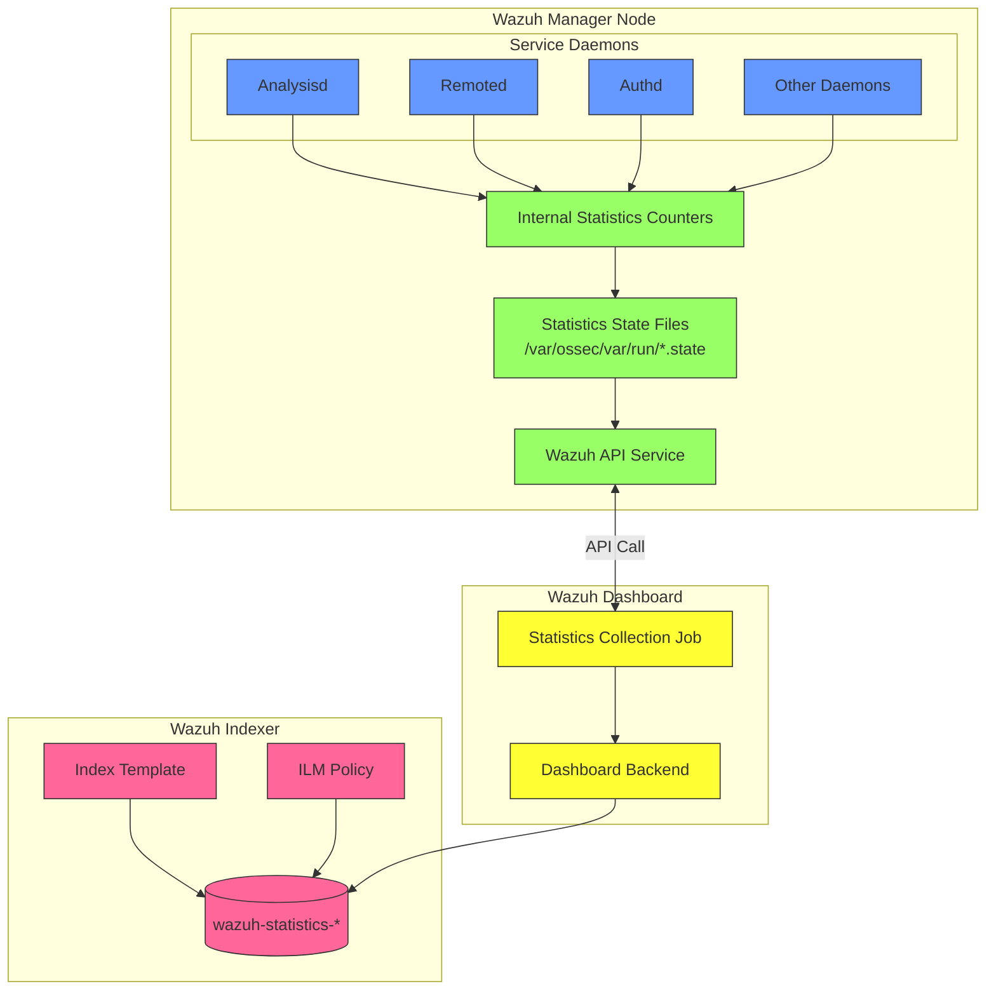
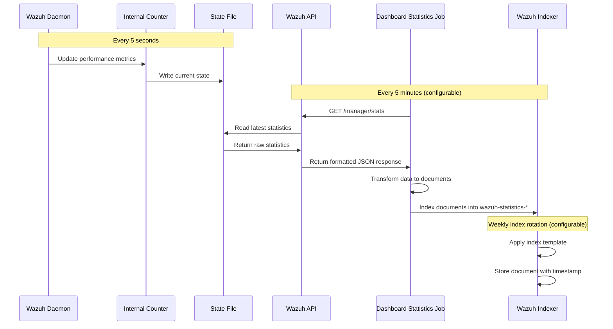
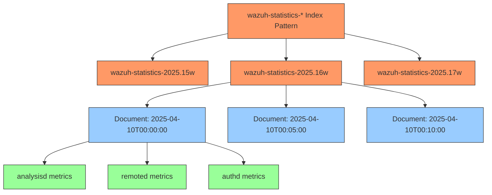
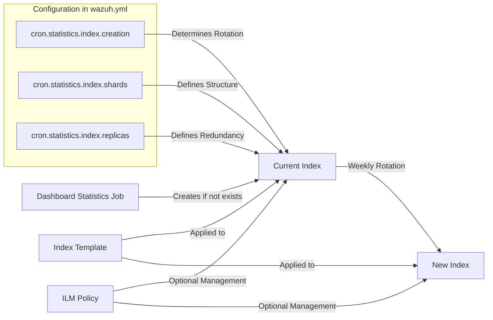
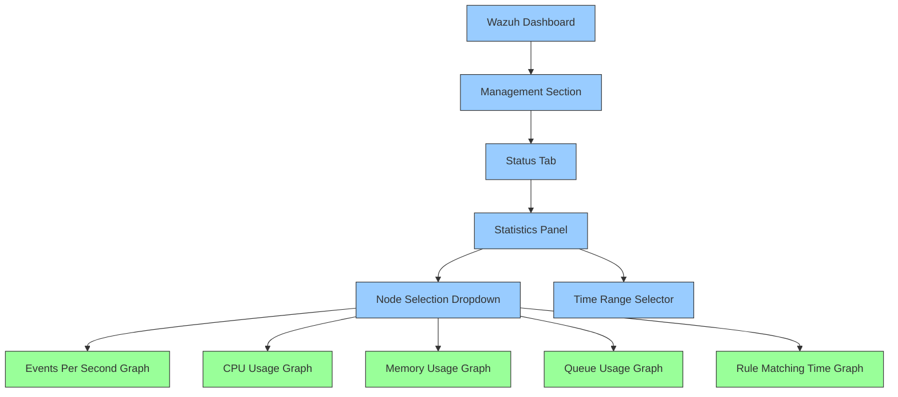
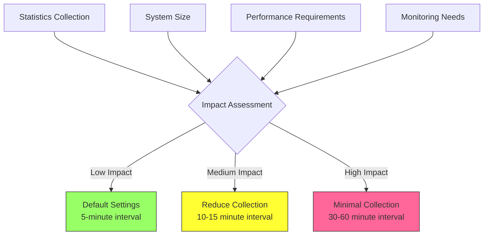
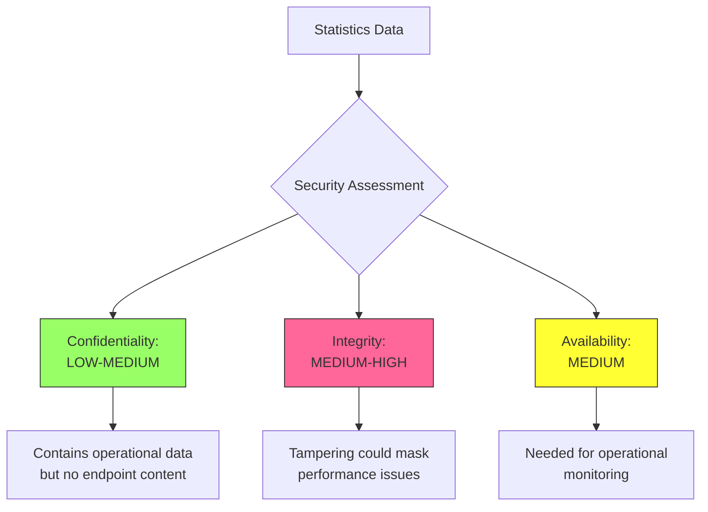

# Wazuh Statistics Index: Technical Documentation

## Executive Summary

This technical document focuses exclusively on the `wazuh-statistics-*` index pattern within the Wazuh security platform. The statistics indices store critical performance metrics about Wazuh manager operations, providing essential visibility into system health, throughput, and resource utilization. This document details the precise mechanisms by which these statistics are generated, collected, stored, and utilized for operational monitoring and capacity planning.

## Table of Contents

1. [Introduction to Wazuh Statistics](#introduction-to-wazuh-statistics)
2. [Statistics Collection Architecture](#statistics-collection-architecture)
3. [Statistical Data Lifecycle](#statistical-data-lifecycle)
4. [Index Structure and Schema](#index-structure-and-schema)
5. [Statistics Index Management](#statistics-index-management)
6. [Querying and Visualization](#querying-and-visualization)
7. [Performance Considerations](#performance-considerations)
8. [Security Implications](#security-implications)
9. [Troubleshooting Statistics Collection](#troubleshooting-statistics-collection)
10. [References](#references)

## Introduction to Wazuh Statistics

The `wazuh-statistics-*` index pattern stores operational metrics from Wazuh manager nodes. Unlike event or alert indices that store security-related data from monitored endpoints, the statistics indices exclusively store internal performance data about the Wazuh platform itself. This self-monitoring capability enables administrators to:

- Monitor system health and performance in real-time
- Identify processing bottlenecks before they impact security monitoring
- Plan capacity based on historical throughput data
- Troubleshoot issues by correlating performance metrics with system behavior
- Ensure continuous operation of security monitoring functions

The statistics indices are populated at regular intervals (5 minutes by default) and use minimal storage compared to event and alert indices, making them a lightweight but powerful component of the Wazuh ecosystem.

## Statistics Collection Architecture

The following diagram illustrates the components involved in generating, collecting, and storing Wazuh statistics:



### Key Components

1. **Service Daemons**
   - **Analysisd**: Processes events and applies rules to generate alerts
   - **Remoted**: Handles agent communication and message queueing
   - **Authd**: Manages agent authentication and registration
   - **Other Daemons**: Various supporting services (execd, monitord, etc.)

2. **Statistics Generation**
   - **Internal Counters**: Memory-resident metrics updated in real-time
   - **State Files**: Periodic snapshots of counters written to disk
     - Located at `/var/ossec/var/run/*.state`
     - Updated every 5 seconds by default
     - Example files: `wazuh-analysisd.state`, `wazuh-remoted.state`

3. **Collection Mechanism**
   - **Wazuh API**: RESTful interface exposing statistics data
   - **Dashboard Statistics Job**: Scheduled task in Wazuh Dashboard
     - Configured in Dashboard settings (`wazuh.yml`)
     - Runs every 5 minutes by default
     - Controlled by `cron.statistics.status` and `cron.statistics.interval`

4. **Storage Components**
   - **Statistics Index**: `wazuh-statistics-*` pattern in Elasticsearch
   - **Index Template**: Defines mapping for statistics fields
   - **ILM Policy**: Manages index lifecycle (optional)

## Statistical Data Lifecycle

The following sequence diagram illustrates the complete lifecycle of statistics data, from generation to storage:



### Detailed Process

1. **Statistics Generation (5-second cycle)**
   - Each Wazuh daemon maintains internal counters for its operations
   - Every 5 seconds, these counters are written to state files
   - The state interval is configurable via `internal_options.conf`:
     ```
     # Default state interval (5 seconds)
     analysisd.state_interval=5
     remoted.state_interval=5
     ```

2. **Statistics Collection (5-minute cycle)**
   - The Wazuh Dashboard runs a scheduled job every 5 minutes
   - This job is configured in the Dashboard's `wazuh.yml` config:
     ```yaml
     cron:
       statistics:
         status: true
         interval: 0 */5 * * * *  # Every 5 minutes
         index:
           name: wazuh-statistics-*
           creation: w  # Weekly rotation
           shards: 1
           replicas: 0
     ```
   - The job calls the Wazuh API endpoint:
     ```
     GET /manager/stats
     ```
   - For clustered deployments, it queries each configured node

3. **Data Transformation**
   - The Dashboard job processes the API response
   - It extracts relevant metrics and formats them as Elasticsearch documents
   - Each document includes:
     - Timestamp
     - Node identifier
     - Component/module name
     - Metric values

4. **Indexing**
   - Documents are indexed into the current active statistics index
   - Default index format: `wazuh-statistics-YYYY.Ww`
     - Example: `wazuh-statistics-2025.16w` (Year 2025, Week 16)
   - The index rotation is configurable (daily, weekly, monthly)
   - New indices are created automatically based on templates

## Index Structure and Schema

The `wazuh-statistics-*` indices follow a consistent schema defined by the Wazuh index template. Each document represents a point-in-time snapshot of performance metrics from a specific Wazuh component.

### Index Structure



### Document Schema

Each document in the statistics index contains structured fields organized by component. Here's a detailed breakdown of the schema:

#### Common Fields

| Field | Type | Description |
|-------|------|-------------|
| `@timestamp` | date | Timestamp when statistics were collected |
| `manager` | keyword | Manager node identifier (hostname or configured name) |
| `cluster.name` | keyword | Cluster name (if clustering is enabled) |
| `cluster.node` | keyword | Node type (master/worker) in cluster |

#### Analysisd Fields

| Field | Type | Description |
|-------|------|-------------|
| `analysisd.event_queue_usage` | float | Analysis event queue utilization percentage |
| `analysisd.events_dropped` | long | Number of events dropped due to queue overflow |
| `analysisd.events_processed` | long | Number of events processed through rules |
| `analysisd.events_received` | long | Number of events received for processing |
| `analysisd.alerts_written` | long | Number of alerts written to disk |
| `analysisd.firewall_written` | long | Number of firewall events written |
| `analysisd.syscheck_queue_usage` | float | FIM queue utilization percentage |
| `analysisd.syscollector_queue_usage` | float | Syscollector queue utilization percentage |
| `analysisd.rootcheck_queue_usage` | float | Rootcheck queue utilization percentage |
| `analysisd.sca_queue_usage` | float | SCA queue utilization percentage |
| `analysisd.hostinfo_queue_usage` | float | Host info queue utilization percentage |
| `analysisd.winevt_queue_usage` | float | Windows event queue utilization percentage |
| `analysisd.rule_matching_queue_usage` | float | Rule matching queue utilization percentage |
| `analysisd.event_decoder_time_usage` | float | CPU usage of event decoder thread |
| `analysisd.rule_checking_time_usage` | float | CPU usage of rule checking thread |
| `analysisd.max_eps` | long | Maximum events per second rate |

#### Remoted Fields

| Field | Type | Description |
|-------|------|-------------|
| `remoted.queue_size` | long | Size of remoted message queue |
| `remoted.queue_usage` | float | Current utilization of message queue |
| `remoted.tcp_sessions` | long | Number of active TCP sessions with agents |
| `remoted.evt_count` | long | Number of events received from agents |
| `remoted.ctrl_msg_count` | long | Number of control messages processed |
| `remoted.discarded_count` | long | Number of messages discarded (dropped) |
| `remoted.recv_bytes` | long | Total bytes received from agents |
| `remoted.sent_bytes` | long | Total bytes sent to agents |

#### Additional Components

Statistics for other components like `authd`, `execd`, `monitord`, etc. follow similar patterns, with fields specific to their functions.

### Sample Document

```json
{
  "@timestamp": "2025-04-17T06:20:00.000Z",
  "manager": "wazuh-master-1",
  "cluster": {
    "name": "wazuh-cluster",
    "node": "master"
  },
  "analysisd": {
    "events_received": 138283,
    "events_processed": 112252,
    "events_dropped": 0,
    "alerts_written": 6707,
    "event_queue_usage": 0.15,
    "syscheck_queue_usage": 0.02,
    "syscollector_queue_usage": 0.00,
    "rootcheck_queue_usage": 0.00,
    "sca_queue_usage": 0.08,
    "rule_matching_queue_usage": 0.12,
    "max_eps": 876
  },
  "remoted": {
    "queue_size": 131072,
    "queue_usage": 0.04,
    "tcp_sessions": 130,
    "evt_count": 19097,
    "ctrl_msg_count": 3444,
    "discarded_count": 0,
    "recv_bytes": 435879,
    "sent_bytes": 127543
  }
}
```

## Statistics Index Management

Proper management of the statistics indices ensures optimal performance and storage utilization while maintaining necessary historical data.

### Index Creation and Rotation



The statistics indices are created and managed as follows:

1. **Index Creation**
   - The Dashboard's statistics job creates indices automatically
   - Index naming convention: `wazuh-statistics-YYYY.Ww`
   - Configuration options in `wazuh.yml`:
     ```yaml
     cron:
       statistics:
         index:
           name: wazuh-statistics-*
           creation: w  # w=weekly, d=daily, m=monthly
           shards: 1    # Number of primary shards
           replicas: 0  # Number of replica shards
     ```

2. **Index Template**
   - Applied automatically to new indices
   - Defines field mappings for all statistics metrics
   - Template name: `wazuh-statistics`
   - Default settings: 1 primary shard, 0 replicas

3. **Index Lifecycle Management (Optional)**
   - Can be configured to automatically manage retention
   - Example ILM policy:
     ```json
     {
       "policy": {
         "phases": {
           "hot": {
             "actions": {}
           },
           "delete": {
             "min_age": "30d",
             "actions": {
               "delete": {}
             }
           }
         }
       }
     }
     ```

### Storage Requirements

Statistics indices have minimal storage requirements compared to event and alert indices:

- Each document size: ~2-5 KB
- Documents per day: 288 (at 5-minute intervals)
- Typical weekly index size: 5-10 MB
- Annual storage for statistics: ~0.5-1 GB

This small footprint makes long-term retention feasible without significant storage costs.

## Querying and Visualization

The statistics indices can be queried directly or visualized through the Wazuh Dashboard interface.

### Dashboard Visualization

The Wazuh Dashboard provides built-in visualizations for statistics data in the Management > Status section:



### Direct Querying

For custom analysis or integration with external monitoring systems, you can query the indices directly via the Elasticsearch API:

1. **Basic Query**
   ```json
   GET wazuh-statistics-*/_search
   {
     "query": {
       "range": {
         "@timestamp": {
           "gte": "now-1d",
           "lte": "now"
         }
       }
     },
     "sort": [
       { "@timestamp": "desc" }
     ],
     "size": 10
   }
   ```

2. **Aggregation Query (Events per Hour)**
   ```json
   GET wazuh-statistics-*/_search
   {
     "size": 0,
     "query": {
       "range": {
         "@timestamp": {
           "gte": "now-1d",
           "lte": "now"
         }
       }
     },
     "aggs": {
       "events_over_time": {
         "date_histogram": {
           "field": "@timestamp",
           "calendar_interval": "hour"
         },
         "aggs": {
           "avg_events": {
             "avg": {
               "field": "analysisd.events_received"
             }
           }
         }
       }
     }
   }
   ```

3. **Alert Rate by Node**
   ```json
   GET wazuh-statistics-*/_search
   {
     "size": 0,
     "query": {
       "range": {
         "@timestamp": {
           "gte": "now-1d",
           "lte": "now"
         }
       }
     },
     "aggs": {
       "by_node": {
         "terms": {
           "field": "manager"
         },
         "aggs": {
           "avg_alerts": {
             "avg": {
               "field": "analysisd.alerts_written"
             }
           }
         }
       }
     }
   }
   ```

## Performance Considerations

The statistics collection mechanism is designed to minimize impact on Wazuh operations while providing valuable insights.

### Impact Assessment

1. **Resource Usage**
   - CPU: Minimal (~0.1-0.2% per collection)
   - Memory: Negligible (counters are always in memory)
   - Disk I/O: Very low (small state files written every 5 seconds)
   - Network: Minimal (small API calls every 5 minutes)

2. **Scaling Factors**
   - Number of nodes in cluster
   - Collection frequency
   - Retention period

### Optimization Recommendations



For optimal performance:

1. **Collection Interval**
   - Default (5 minutes) is suitable for most deployments
   - Reduce frequency for very large clusters or resource-constrained environments
   - Configuration: `cron.statistics.interval` in `wazuh.yml`

2. **Index Settings**
   - Maintain default of 1 shard for statistics indices
   - Increase replicas (0→1) only if high availability is required
   - Configuration: `cron.statistics.index.shards/replicas` in `wazuh.yml`

3. **Retention Policy**
   - Implement ILM to automatically manage older indices
   - Recommended retention: 30-90 days for statistics
   - Long-term trends can be preserved through periodic snapshots

## Security Implications

The statistics collection system has specific security considerations that differ from event and alert data.

### Threat Model



1. **Data Sensitivity**
   - Statistics contain operational metrics, not security events or PII
   - May reveal infrastructure details (node names, agent counts)
   - Generally lower sensitivity than alert or event data

2. **Access Control**
   - Restrict API access to authenticated services
   - Implement role-based access to statistics indices
   - Example Elasticsearch role definition:
     ```json
     {
       "indices": [
         {
           "names": ["wazuh-statistics-*"],
           "privileges": ["read"]
         }
       ]
     }
     ```

3. **Integrity Protection**
   - Statistics data should be integrity-protected
   - Modifications could mask performance issues or attacks
   - Elasticsearch index security features should be enabled

## Troubleshooting Statistics Collection

Common issues with statistics collection and their solutions:

### Collection Issues

1. **Missing Statistics**
   ```
   Symptom: No new documents in wazuh-statistics-* indices

   Troubleshooting Steps:
   1. Check cron job status in wazuh.yml:
      $ grep -A 10 "statistics" /usr/share/wazuh-dashboard/data/wazuh/config/wazuh.yml

   2. Verify API connectivity:
      $ curl -k -X GET "https://localhost:55000/manager/stats" \
        -H "Authorization: Bearer $TOKEN"

   3. Check for errors in dashboard logs:
      $ tail -f /var/log/wazuh-dashboard/opensearch-dashboards.log

   Common Solutions:
   - Enable statistics collection (cron.statistics.status: true)
   - Fix API authentication issues
   - Restart dashboard service
   ```

2. **Incomplete Statistics**
   ```
   Symptom: Some fields missing in statistics documents

   Troubleshooting Steps:
   1. Check daemon state files:
      $ cat /var/ossec/var/run/wazuh-analysisd.state
      $ cat /var/ossec/var/run/wazuh-remoted.state

   2. Verify API response completeness:
      $ curl -k -X GET "https://localhost:55000/manager/stats" \
        -H "Authorization: Bearer $TOKEN" | jq

   Common Solutions:
   - Restart problematic daemon
   - Update to latest Wazuh version
   - Check permissions on state files
   ```

### Query Issues

1. **No Data in Visualizations**
   ```
   Symptom: Empty graphs in Wazuh Dashboard statistics section

   Troubleshooting Steps:
   1. Verify indices exist:
      $ curl -X GET "https://localhost:9200/_cat/indices/wazuh-statistics-*?v" \
        -u elastic:password

   2. Check documents count:
      $ curl -X GET "https://localhost:9200/wazuh-statistics-*/_count" \
        -u elastic:password

   3. Verify time range in dashboard

   Common Solutions:
   - Adjust time range to match existing data
   - Check index pattern configuration in Kibana
   - Verify field mappings in index template
   ```

2. **Performance Degradation**
   ```
   Symptom: Slow queries or dashboard loading

   Troubleshooting Steps:
   1. Check index size and document count:
      $ curl -X GET "https://localhost:9200/_cat/indices/wazuh-statistics-*?v&h=index,docs.count,store.size" \
        -u elastic:password

   2. Review shard allocation:
      $ curl -X GET "https://localhost:9200/_cat/shards?v&index=wazuh-statistics-*" \
        -u elastic:password

   Common Solutions:
   - Implement index lifecycle policies
   - Optimize number of shards (typically 1 is sufficient)
   - Increase collection interval if too many documents
   ```

## References

1. [Wazuh Documentation - Index Pattern Reference](https://documentation.wazuh.com/current/user-manual/elasticsearch/index.html)
2. [Wazuh Documentation - Manager Statistics API](https://documentation.wazuh.com/current/user-manual/api/reference.html#statistics)
3. [Wazuh Documentation - Dashboard Configuration](https://documentation.wazuh.com/current/user-manual/wazuh-dashboard/config-file.html)
4. [Elasticsearch Documentation - Index Management](https://www.elastic.co/guide/en/elasticsearch/reference/current/index-management.html)
5. [Wazuh Documentation - Performance Tuning](https://documentation.wazuh.com/current/user-manual/manager/performance.html)
