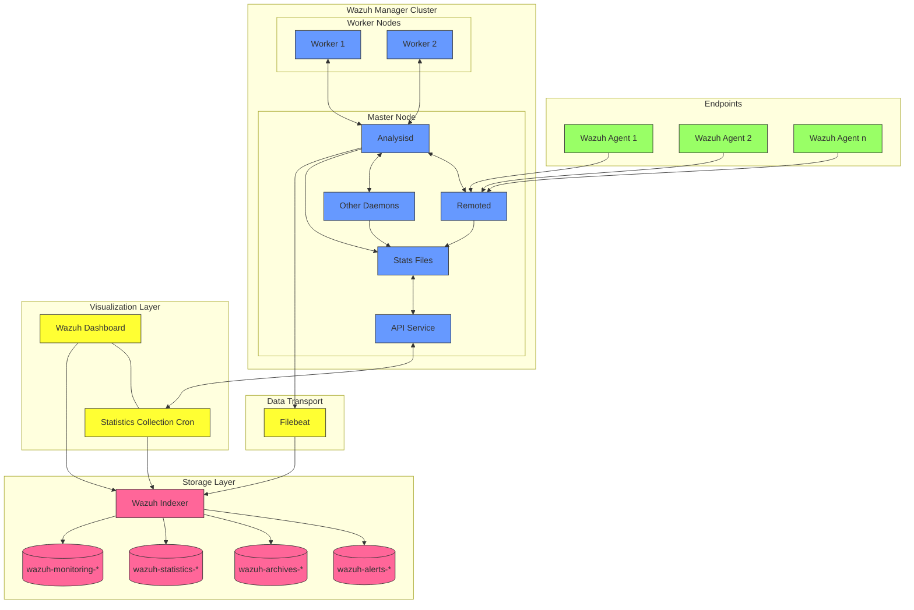
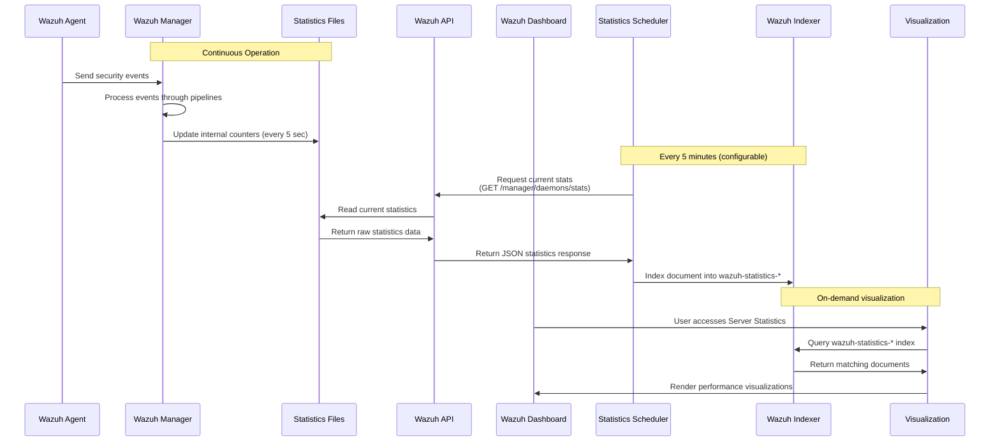

# Wazuh Statistical Logs: Architecture, Storage & Retrieval

## Executive Summary

This technical document provides a comprehensive analysis of how Wazuh generates, stores, and processes statistical logs within the `wazuh-statistics-*` index pattern. It details the architecture components, data flow, security considerations, and best practices for enterprise deployments. The statistical logs provide critical visibility into the operational health of Wazuh infrastructure, serving as an essential component for security operations teams to monitor system performance, identify bottlenecks, and ensure continuous protection.

## Table of Contents

1. [Introduction](#introduction)
2. [System Architecture](#system-architecture)
3. [Statistical Data Workflow](#statistical-data-workflow)
4. [Index Structure and Schema](#index-structure-and-schema)
5. [Security Considerations](#security-considerations)
6. [Performance Monitoring](#performance-monitoring)
7. [Troubleshooting Guidelines](#troubleshooting-guidelines)
8. [Conclusion](#conclusion)
9. [References](#references)

## Introduction

Wazuh is an open-source security platform that provides unified XDR and SIEM capabilities for enterprise environments. In addition to collecting and analyzing security events, Wazuh maintains detailed performance metrics about its own operation through statistical logs. These logs are critical for monitoring the health and performance of the Wazuh deployment.

The `wazuh-statistics-*` index pattern stores performance metrics from the Wazuh manager and cluster nodes, including:

- Event throughput and processing rates
- Queue utilization and capacity metrics
- Agent connection statistics
- System resource usage
- Component-specific performance indicators

By default, Wazuh creates a new statistics index weekly (denoted by year and week number) and inserts a new document every 5 minutes with updated statistics. This interval-based approach ensures that administrators have access to near real-time performance data while maintaining a manageable index size.

## System Architecture

The Wazuh architecture consists of several components that work together to collect, process, store, and visualize security data and system statistics.



### Key Components

1. **Wazuh Agents**: Deployed on endpoints to collect security events and logs.

2. **Wazuh Manager**: The central component that receives and processes data from agents.
   - **Analysisd**: Decodes and analyzes incoming logs, matching them against rules.
   - **Remoted**: Handles agent communications and connection management.
   - **Statistics Files**: Internal state files (e.g., `wazuh-analysisd.state`, `wazuh-remoted.state`) updated every 5 seconds with current metrics.
   - **API Service**: RESTful API that exposes internal metrics and configuration.

3. **Filebeat**: Lightweight data shipper that forwards event logs to the indexer.

4. **Wazuh Indexer**: Built on Elasticsearch/OpenSearch, stores data in dedicated indices:
   - `wazuh-alerts-*`: Security alerts generated by rule matches
   - `wazuh-archives-*`: All raw events received
   - `wazuh-monitoring-*`: Agent status information
   - `wazuh-statistics-*`: Manager performance metrics

5. **Wazuh Dashboard**: Web interface based on Kibana for data visualization.
   - **Statistics Collection Cron**: Background task that calls the Wazuh API to fetch the latest stats and indexes them.

In enterprise deployments, Wazuh components are typically deployed in clusters for high availability and scalability. The manager cluster consists of a master node and worker nodes that share the processing load. Similarly, the indexer can be clustered for redundancy and performance.

## Statistical Data Workflow

The following diagram illustrates the end-to-end process of how Wazuh statistical logs are generated, collected, stored, and visualized:



### Workflow Stages

1. **Statistics Generation**
   - Wazuh Manager daemons (Analysisd, Remoted, etc.) update internal counters as they process events
   - These counters are written to statistics files in `/var/ossec/var/run/` every 5 seconds
   - Examples: `wazuh-analysisd.state`, `wazuh-remoted.state`
   - These files provide a real-time snapshot of component performance

2. **API-Based Collection**
   - Every 5 minutes, the Wazuh Dashboard's scheduled task calls the Wazuh API
   - The API reads the latest statistics from the .state files and internal counters
   - It returns a consolidated JSON response with metrics from all monitored components
   - In clustered deployments, statistics are collected from all manager nodes

3. **Indexing Process**
   - The Dashboard processes the API response and transforms it into Elasticsearch documents
   - Documents are indexed into the `wazuh-statistics-*` index (e.g., `wazuh-statistics-2025.16w`)
   - Each document includes a timestamp, node identifier, and component-specific metrics
   - The index is created automatically using a predefined template if it doesn't exist

4. **Visualization**
   - Users access the Server Management > Statistics section in the Wazuh Dashboard
   - The dashboard queries the `wazuh-statistics-*` index for the selected time range
   - Data is presented as time-series graphs, tables, and other visualizations
   - Users can filter or select specific manager nodes to view their statistics

### Security Implications

This workflow has several security implications worth noting:

- The statistics collection occurs internally within the Wazuh ecosystem, minimizing external attack vectors
- The API calls between the Dashboard and Manager are authenticated and can be encrypted
- The statistics data does not contain sensitive information, reducing privacy concerns
- The interval-based collection ensures minimal performance impact on the Wazuh Manager

## Index Structure and Schema

The `wazuh-statistics-*` index follows a structured schema designed to accommodate metrics from various Wazuh components. Each document in the index represents a point-in-time snapshot of performance metrics.

### Key Fields

#### Common Fields
- `@timestamp`: Date/time when the statistics snapshot was taken
- `manager` or `node_name`: Identifier for the Wazuh manager node
- `module`: Indicates the source component (e.g., "wazuh-analysisd", "wazuh-remoted")

#### Analysisd Metrics
- `total_events_decoded`: Total events decoded since manager start
- `events_received`: Events received in the latest interval
- `events_processed`: Events that underwent full rule matching
- `events_dropped`: Events dropped due to queue overflow or processing lag
- `alerts_written`: Number of alerts written to disk
- Event type breakdowns: `syscheck_events_decoded`, `sca_events_decoded`, etc.

#### Remoted Metrics
- `tcp_sessions`: Current number of active TCP agent connections
- `queue_size`: Size of the incoming message queue
- `queue_usage`: Current utilization of the queue (percentage)
- `msg_received`/`evt_count`: Messages received from agents
- `msg_sent`: Messages sent to Analysisd
- `discarded_count`: Agent messages dropped
- `recv_bytes`/`sent_bytes`: Cumulative traffic volume

#### Queue Metrics
- Various queue utilization statistics:
  - `syscheck_queue_usage`
  - `rootcheck_queue_usage`
  - `sca_queue_usage`
  - `alerts_queue_usage`

#### Other Metrics
- `uptime`: Manager uptime at time of collection
- `keys_reload_count`: Number of agent key reloads
- Module-specific metrics for other components

### Sample Document

```json
{
  "@timestamp": "2025-04-17T06:20:00.000Z",
  "manager": "wazuh-master-1",
  "module": "wazuh-analysisd",
  "events_received": 138283,
  "events_processed": 112252,
  "events_dropped": 0,
  "alerts_written": 6707,
  "total_events_decoded": 137726,
  "syscheck_events_decoded": 3935,
  "sca_events_decoded": 8991,
  "other_events_decoded": 8176,
  "queue_size": 131072,
  "queue_usage": 0.0,
  "syscheck_queue_usage": 0.0,
  "rootcheck_queue_usage": 0.0,
  "sca_queue_usage": 0.0,
  "alerts_queue_usage": 0.0
}
```

### Index Configuration

The `wazuh-statistics-*` index is configured with the following default settings:

- Index rotation: Weekly (configurable to daily or monthly)
- Primary shards: 1 (default, as statistics data volume is low)
- Replica shards: 0 (default, can be increased for redundancy)
- Field mappings: Defined by the Wazuh index template

## Security Considerations

Proper management of Wazuh statistics logs requires attention to several security aspects:

### Access Control

- **API Authentication**: Ensure the Wazuh API uses strong authentication to prevent unauthorized access to statistics data.
- **Index Permissions**: Implement role-based access control for the `wazuh-statistics-*` index in Elasticsearch.
- **Dashboard Permissions**: Restrict access to the Statistics dashboard to authorized administrators.

### Data Protection

- **Transport Encryption**: Enable TLS for all communications between Wazuh components.
- **Index Encryption**: Consider enabling encryption-at-rest for sensitive Elasticsearch indices.
- **Backup Security**: Ensure backups of statistics data are properly secured.

### Threat Detection

The statistics indices themselves can be used as signals for potential security issues:

- **Sudden Drops in Event Processing**: May indicate a DoS attack or system failure.
- **Unusual Queue Utilization**: Could signal an event flood attack.
- **Agent Connection Spikes**: Might indicate agent spoofing or unauthorized deployments.

### Audit Trail

- Enable audit logging for all access to statistics data.
- Monitor for unauthorized attempts to modify statistics collection settings.
- Preserve statistics indices for forensic analysis if needed.

## Performance Monitoring

The statistics logs serve as a foundation for monitoring Wazuh's performance and can be leveraged to detect and address issues before they impact security operations.

### Key Performance Indicators

1. **Event Processing Rate**
   - Monitor `events_received` vs. `events_processed` to identify processing bottlenecks
   - Track the trend over time to anticipate capacity needs

2. **Queue Utilization**
   - Watch queue usage percentages to detect backpressure
   - Alert on sustained high queue usage (>70%)

3. **Event Drops**
   - Zero tolerance for `events_dropped` > 0
   - Implement immediate alerting for any dropped events

4. **Agent Connections**
   - Monitor `tcp_sessions` to ensure agent count matches expectations
   - Track connection trends to detect agent communication issues

### Recommended Alerting Thresholds

| Metric | Warning Threshold | Critical Threshold | Recommended Action |
|--------|-------------------|-------------------|-------------------|
| `events_dropped` | >0 | >100 | Increase Analysisd threads or deploy additional worker nodes |
| `queue_usage` | >70% | >90% | Increase queue size or add worker nodes |
| `tcp_sessions` | >80% of capacity | >95% of capacity | Add manager nodes or redistribute agents |
| `alerts_written` | Sudden 2x increase | Sudden 5x increase | Investigate potential security incident |

## Troubleshooting Guidelines

### Common Issues and Solutions

1. **High Event Drop Rate**
   ```
   Symptom: events_dropped > 0 and increasing
   Possible Causes:
   - Insufficient Analysisd threads
   - Undersized event queues
   - Complex rule set causing slow processing

   Solutions:
   - Increase thread_pool in ossec.conf
   - Increase queue_size in internal_options.conf
   - Optimize rule set or add more worker nodes
   ```

2. **Queue Saturation**
   ```
   Symptom: queue_usage approaching 100%
   Possible Causes:
   - Event burst from agents
   - Slow rule processing
   - Network bottlenecks

   Solutions:
   - Increase queue capacity
   - Add agent buffer throttling
   - Distribute load across cluster nodes
   ```

3. **Index Growth Issues**
   ```
   Symptom: Disk space warnings on Elasticsearch nodes
   Possible Causes:
   - Missing index lifecycle policies
   - Too frequent statistics collection
   - Overly verbose statistics

   Solutions:
   - Implement ILM policies
   - Adjust collection interval
   - Filter unnecessary statistics fields
   ```

### Diagnostic Commands

```bash
# Check current statistics files
sudo cat /var/ossec/var/run/wazuh-analysisd.state

# Query recent statistics via API
curl -k -X GET "https://localhost:55000/manager/stats" -H "Authorization: Bearer $TOKEN"

# Check statistics index status
curl -X GET "https://indexer:9200/_cat/indices/wazuh-statistics-*?v" -u elastic:password

# View statistics collection configuration
sudo grep -A 20 "cron:" /usr/share/wazuh-dashboard/data/wazuh/config/wazuh.yml
```

## Conclusion

Wazuh's statistics log infrastructure provides a robust foundation for monitoring the health and performance of the security platform. By indexing performance metrics into the `wazuh-statistics-*` pattern, Wazuh enables administrators to:

1. **Proactively monitor** system performance and detect issues before they impact security operations
2. **Optimize resource allocation** by identifying bottlenecks and capacity constraints
3. **Plan infrastructure scaling** based on historical performance data
4. **Troubleshoot issues** with detailed visibility into component-level metrics
5. **Enhance security posture** by ensuring continuous and reliable operation of the security monitoring platform

For enterprise deployments, proper management of these statistics is not just an operational concern but a security imperative. Performance degradation in security monitoring systems creates blind spots that adversaries can exploit. By implementing the recommended monitoring, alerting, and security practices outlined in this document, organizations can maintain optimal performance of their Wazuh deployment while ensuring the integrity and availability of their security monitoring infrastructure.

## References

1. [Wazuh Documentation - Index Pattern Reference](https://documentation.wazuh.com/current/user-manual/elasticsearch/index.html)
2. [Wazuh Documentation - Manager Statistics API](https://documentation.wazuh.com/current/user-manual/api/reference.html#statistics)
3. [Wazuh Documentation - Performance Tuning](https://documentation.wazuh.com/current/user-manual/manager/performance.html)
4. [Wazuh Documentation - Cluster Architecture](https://documentation.wazuh.com/current/user-manual/manager/cluster.html)
5. [Wazuh Documentation - Dashboard Configuration](https://documentation.wazuh.com/current/user-manual/wazuh-dashboard/config-file.html)
6. [Elasticsearch Documentation - Index Lifecycle Management](https://www.elastic.co/guide/en/elasticsearch/reference/current/index-lifecycle-management.html)
